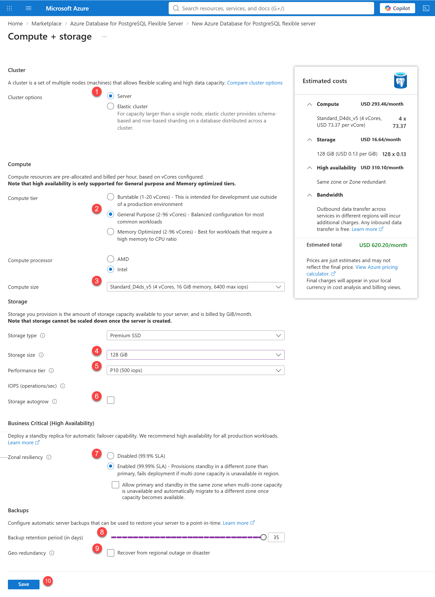

##### 3.2.2.B **Compute + Storage**

from the step **Configure Server** above
 
 
1 - select the cluster option. For this workshop we will use **SERVER** 
2 - Compute. 
2.1 - Compute Tier: General Purpose 
2.2 - Compute Processor: Intel 
3 - Compute Size: select an option from the dropdown menu. Select Standard_D4ds_v5 or an option close to this one with 4 vCores and 16Gib memory, 6400 max iops 
4 - Storage Size 
5 - Performance Tier 
6 - IOPS 
7 - Zonal Resiliency. Select Enabled 
8 - Backups. Select from 0 to 35 days 
9 - Geo-Redundant backup. You can leave off for this workshop 
10 - Save. After Saving, it will take you back to the previous screen with the Basic Tab 
 

 
Go back to Requirements [Azure PostgreSQL Workshop Prerequisites](S0%20-%20Requirements.md)
