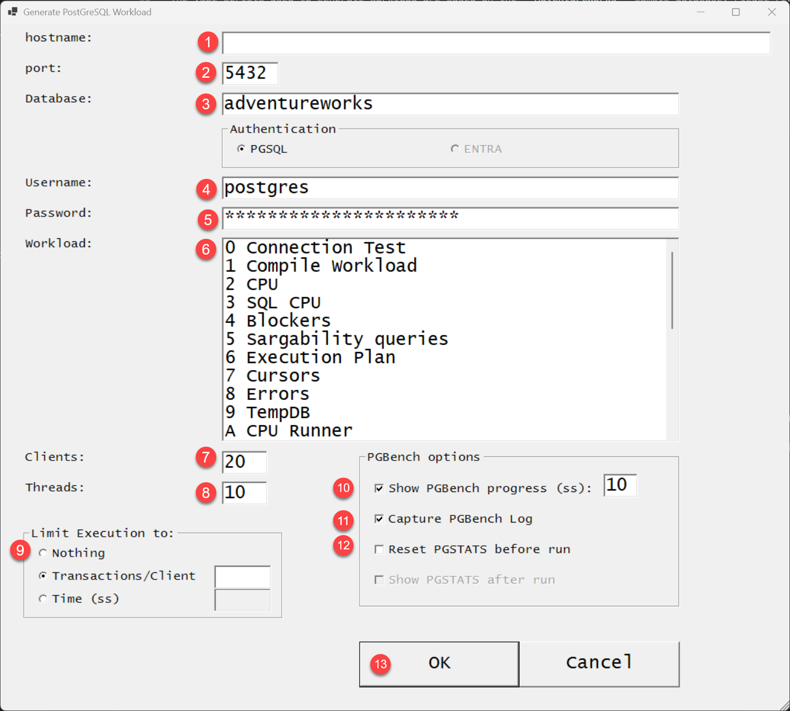
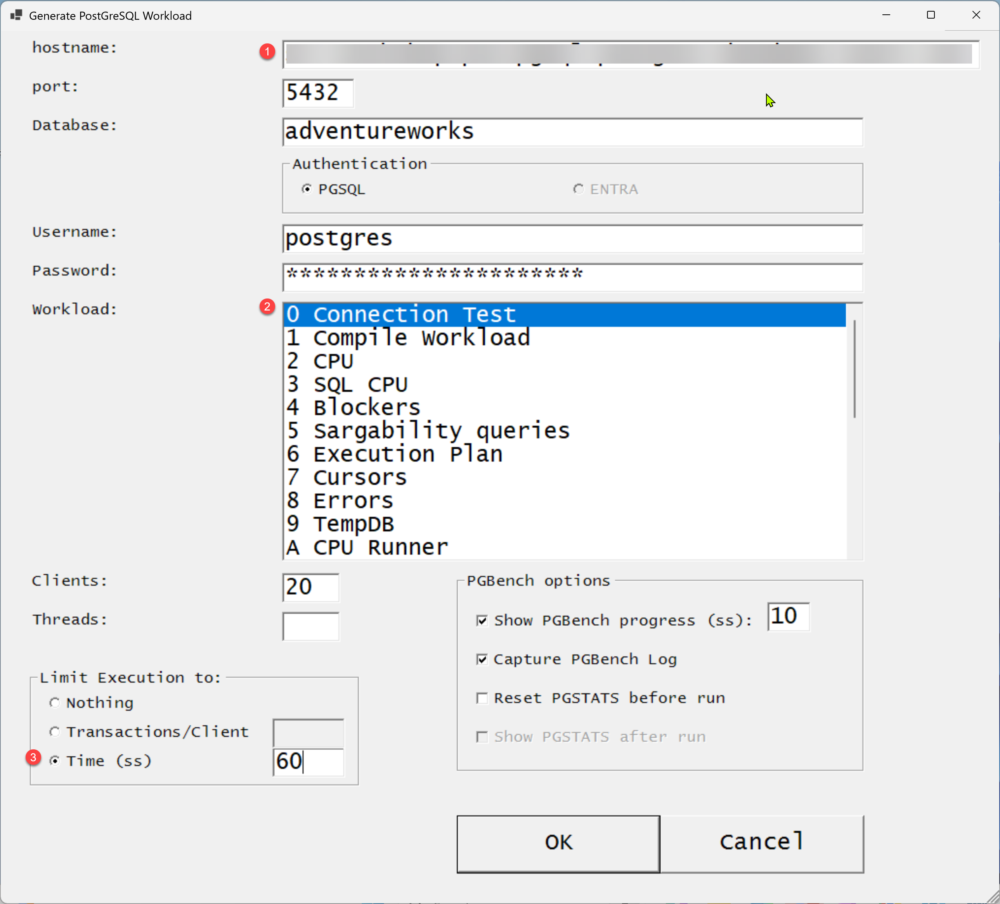

# PostGreSQL Workload Generator

 
 

## Tool Definition

 
PostGreSQL_Workload_Generator is a Powershell script that uses a GUI to allow the user to issue queries targetting a PostgreSQL Server. It uses a combination of resources to generate workload against an AdventureWorks database. The resources are: 
 
<ul>
<li>- a series of SQL scripts, each one used to target a specific area of PostGreSQL Server</li>
<li>- PSQL (part of the [PGADMIN4 utilities](https://www.microsoft.com/en-us/download/104868)) is used to connect to SQL Server and execute one SQL script.</li>
<li>- PGBENCH (part of the [PGADMIN4 utilities](https://www.microsoft.com/en-us/download/104868)) is used to connect to PostGreSQL Server and execute the SQL scripts. It allows for:
</ul>
 
 
 

## GUI Description

 
The Graphical User Interface is shown below. 
You need to propulate the following fields to allow a connection to PostgreSQL: 
<ul>
<li>1 - Hostname: enter the complete server name.</li>
<li>2 - port. Usually **5432**. When using PGBouncer change it to **6432**</li>
<li>3 - Database Name: The name given to the AdventureWorks database.</li>
<li>4 - Username: a valid login to the database, with read/write permissions.</li>
<li>5 - Password: the corresponding password to the username entered above.</li>
<li>6 - Workload: a list of existing workload simulations.</li>
<li>7 - Clients: the number of clientes PGBENCH will execute in parallel with the selected workload.</li>
<li>8 - Threads: the number of Threads PGBENCH will lauch.</li>
<li>9 - Limit execution to
<ul>
<li>a) nothing. PGBench will execute until the user closes the execution screen</li>
<li>b) Transactions/Client. Number of transactions per client that PGBench will execute. it will close the execution screen after it</li>
<li>c) Time (ss). Number of seconds PGBench will stay executing the query. it will close the execution screen after it</li>
</ul>
<li>PGBench Options:</li>
<li>10- Show PGBench Progress every xx seconds:</li>
<li>11- Capture PGBench log</li>
<li>12- Reset PGStats before executing the query</li>
<li>13- Confirm the execution by clicking OK, or end the script by clicking CANCEL</li>
</ul>
 
> :Memo: **Tip:** The value for the password is masked.
 

>The .SQL scripts used to generate workload are based on the **AdventureWorks** sample database. Please read the [pre-requisites](prerequisites.md) to find how to download the sample.
 
 
 

## Executing the tool

The image below illustrates a connection to an Azure Database for PostgreSQL Flexible Server, using default Port 5432, and pointing to the  AdventureWorks database. 
 
For this simmulation, we will validate the tool can connect to that instance, thus the selected workload is "**0 Connection Test**" 
 
 

 
Notice the input used for this sample execution: 
<ul>
<li>Hostname: an Azure Database for PostgreSQL servername was provided.</li>
<li>port: 5432</li>
<li>Workload: **Connection Test is selected**.</li>
<li>Clients: 20.</li>
<li>Limit execution to 60 seconds</li>
<li>PGBench Options:</li>
<li>Show PGBench Progress every 10 seconds:</li>
<li>Capture PGBench log</li>
<li>Reset PGStats before executing the query</li>
</ul>
 

* the following screenshots contain the PGBENCH execution at launch, 10 seconds, 20 seconds, and 60 seconds. 

 
 

 
 

 
 

 
 
now we used PGADMIN to connect to the same server, and visualized the activity. The screenshots below show: 

* Activity Dashboard
* State Dashboard
* System View query execution

 
 

 
 

 
 
