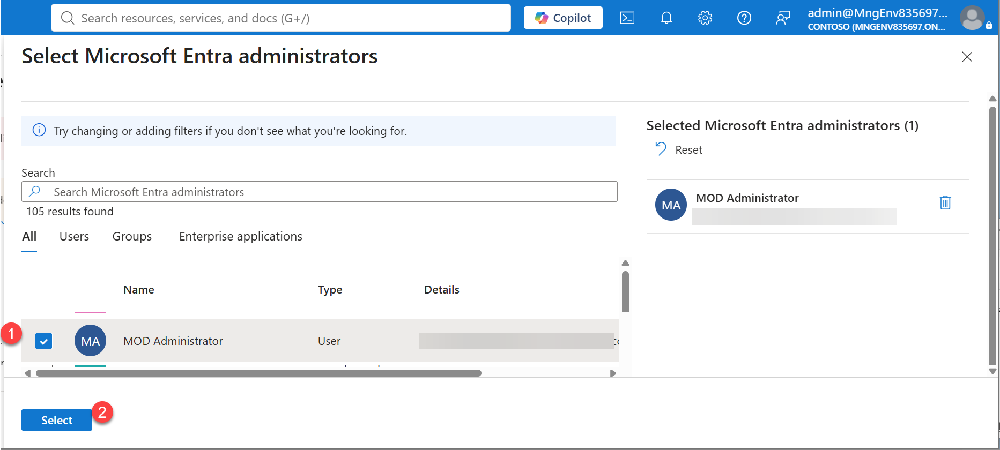

##### 3.2.2.C **Set Admin**

**Set Admin**
 
 

 The dialog will list all available ENTRA accounts. 

1 - Select the account to be used for Azure Database for PostgreSQL Flexible Server admin account 
2 - Click **SELECT** then confirm the operation 

 

 
Go back to Requirements 

[Azure PostgreSQL Workshop Prerequisites](S0%20-%20Requirements.md)
