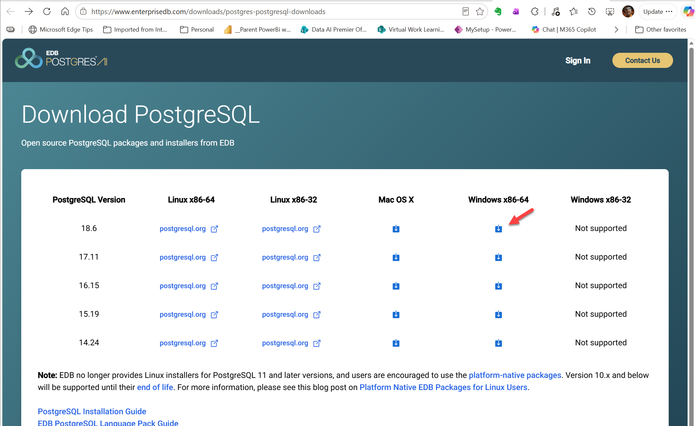
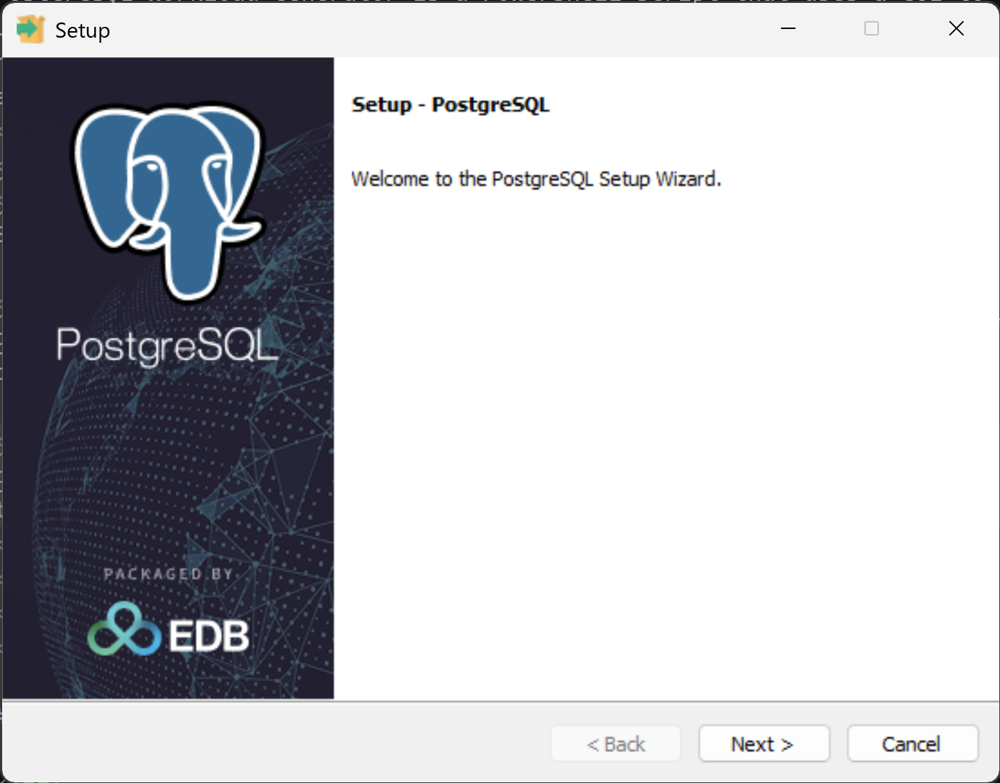
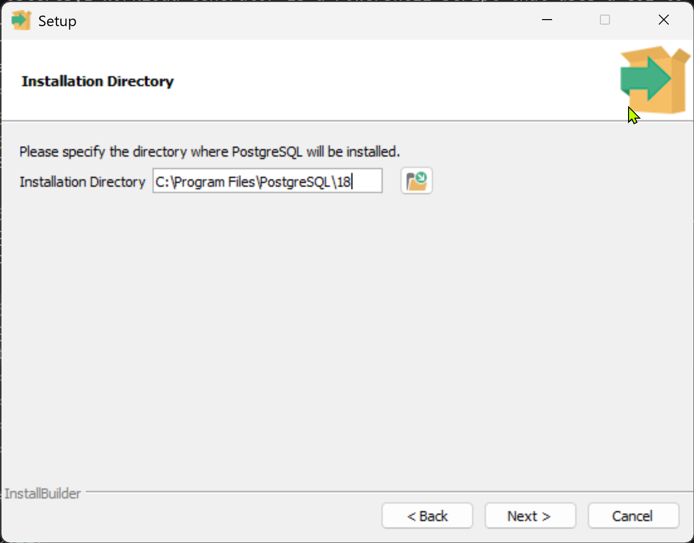
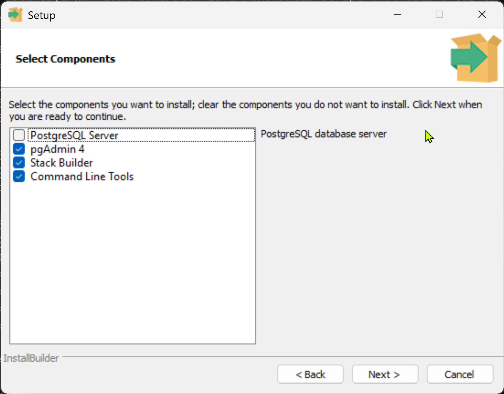
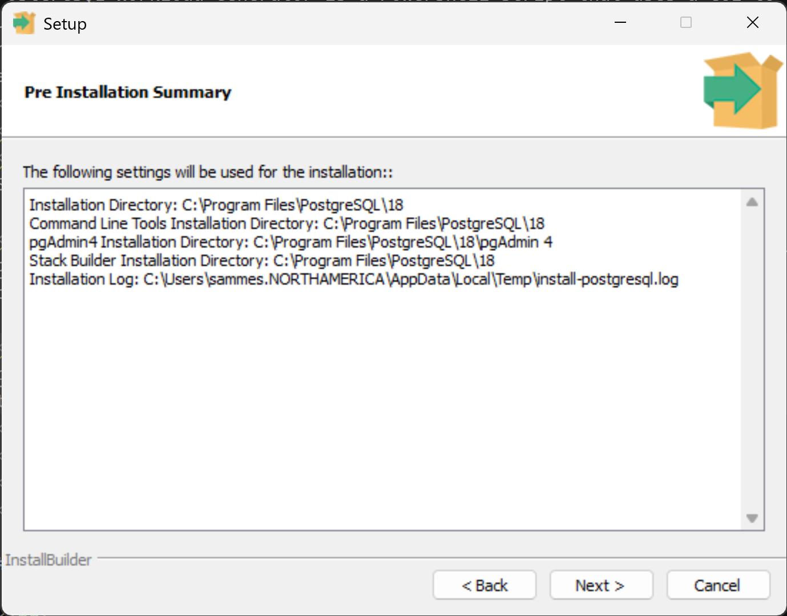

# PGBench Installation

 
1 download the file from: https://www.enterprisedb.com/downloads/postgres-postgresql-downloads 

2. :::image type="content" source="images/PGBench_Setup_01_download.png" alt-text="":::

 

3. go to the downloads folder: 

 

4. Execute the downloaded file: 

 

during the install, PGBench shows the default folder where it will be installed. **Copy that path to be added into the Environment Variables**

 

6. Uncheck PostGreSQL from the options: 

 

7. Complete the install 

 

8. Add the PATH captured on step 4 above into the Environment Variables **PATH**

