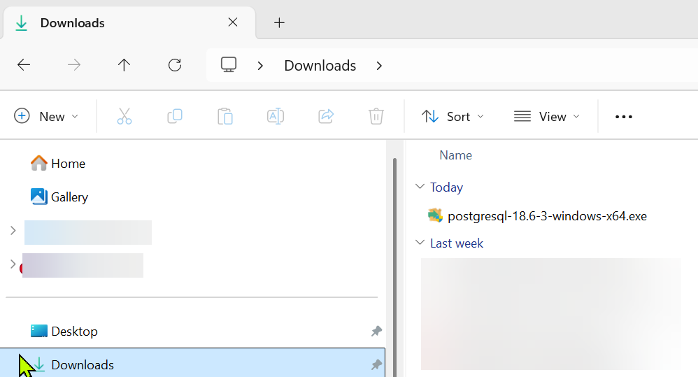

# PGBench Installation

 
1 download the file from: https://www.enterprisedb.com/downloads/postgres-postgresql-downloads 

 

2. go to the downloads folder: 

 

3. Execute the downloaded file: 

 

during the install, PGBench shows the default folder where it will be installed. **Copy that path to be added into the Environment Variables**

 

4. Uncheck PostGreSQL from the options: 

 

5. Complete the install 

 

6. Add the PATH captured on step 3 above into the Environment Variables **PATH**

