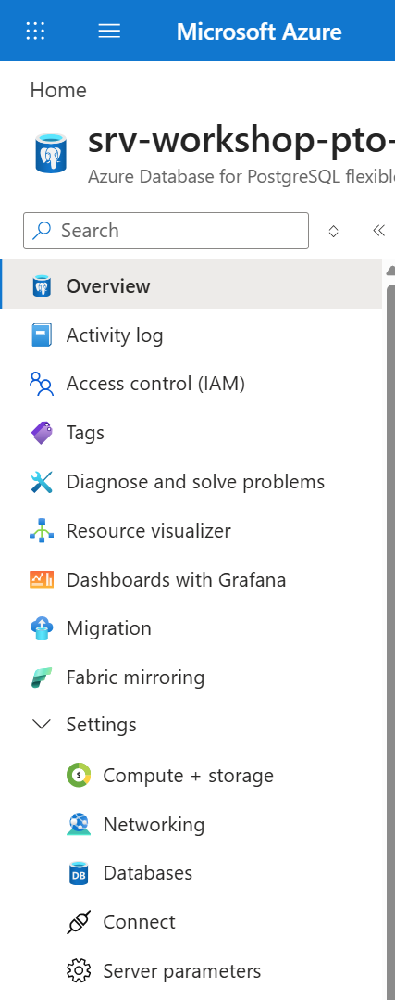
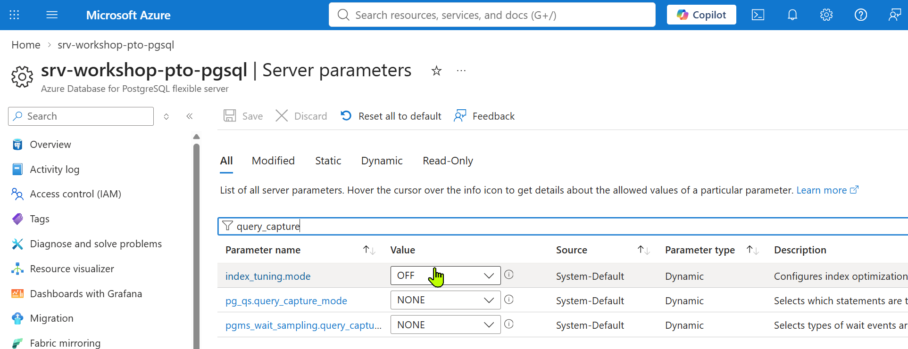
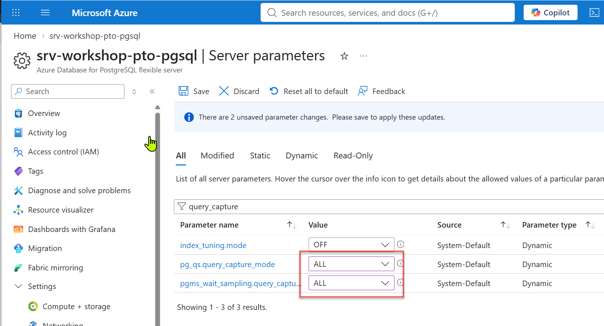
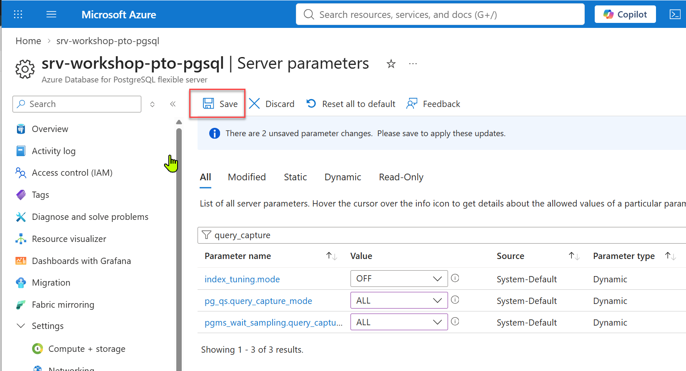

# Enable Query Store on Azure Database for PostgreSQL Flexible Server

To enable **Query Store** on **Azure Database for PostgreSQL Flexible Server**, use the steps below.

## Using the Azure Portal

1. Open your **Azure Database for PostgreSQL Flexible Server**.
2. Select **Server parameters** (or **Parameters**) under **Settings**.

</br>



</br>


3. Search for:

   ```text
   pg_qs.query_capture_mode
   ```

</br>



</br>


4. Set it to one of the following values:
   - **TOP**: Captures only top-level client queries.
   - **ALL**: Captures top-level and nested queries, including queries executed inside functions or procedures.

</br>



</br>


5. Select **Save**.


</br>



</br>


Allow up to **20 minutes** for the first Query Store data to appear in the `azure_sys` database.

## Enable Wait Statistics (Recommended)

For wait analysis and Query Performance Insights:

1. Search for:

   ```text
   pgms_wait_sampling.query_capture_mode
   ```

2. Set it to:

   ```text
   ALL
   ```

3. Save the change.

## Verify Query Store Data

After workload has been running for a while, connect to the server and query the Query Store runtime statistics:

```sql
SELECT *
FROM query_store.qs_view;
```

For wait statistics:

```sql
SELECT *
FROM query_store.pgms_wait_sampling_view;
```

Query Store data is stored in the **`azure_sys`** database managed by the service.

## Azure CLI Alternative

Enable Query Store:

```bash
az postgres flexible-server parameter set \
  --resource-group MyResourceGroup \
  --server-name MyPgServer \
  --name pg_qs.query_capture_mode \
  --value all
```

Enable wait sampling:

```bash
az postgres flexible-server parameter set \
  --resource-group MyResourceGroup \
  --server-name MyPgServer \
  --name pgms_wait_sampling.query_capture_mode \
  --value all
```

## Best Practices

- Use **TOP** for most production systems to minimize overhead.
- Use **ALL** temporarily when investigating performance issues or when visibility into queries executed inside stored procedures or functions is required.
- **Do not enable Query Store on the Burstable pricing tier (B-series)** because it can negatively affect performance.
- If you use Query Store, avoid collecting the same statistics through `pg_stat_statements` unless they are specifically required, to reduce unnecessary overhead.

## Recommended Workshop and Demo Configuration

For PostgreSQL workshops and demonstrations, use:

```text
pg_qs.query_capture_mode = ALL
pgms_wait_sampling.query_capture_mode = ALL
```

This configuration supports demonstrations involving Query Performance Insights, wait analysis, index recommendations, and workload tuning scenarios.

## References

- [Query Store in Azure Database for PostgreSQL Flexible Server](https://learn.microsoft.com/en-us/azure/postgresql/monitor/concepts-query-store)
- [Best practices for Query Store in Azure Database for PostgreSQL Flexible Server](https://learn.microsoft.com/en-us/azure/postgresql/monitor/concepts-query-store-best-practices)
