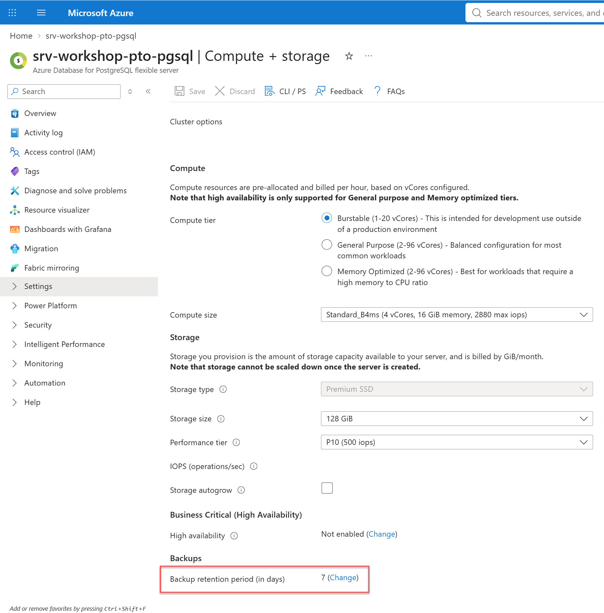
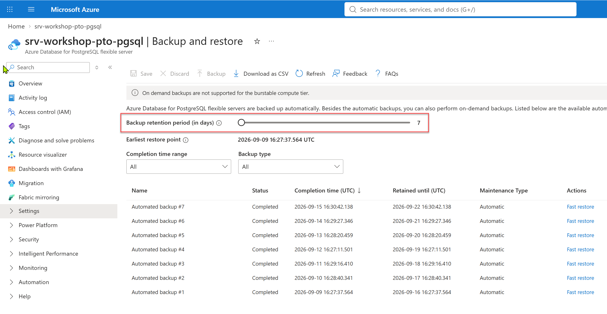
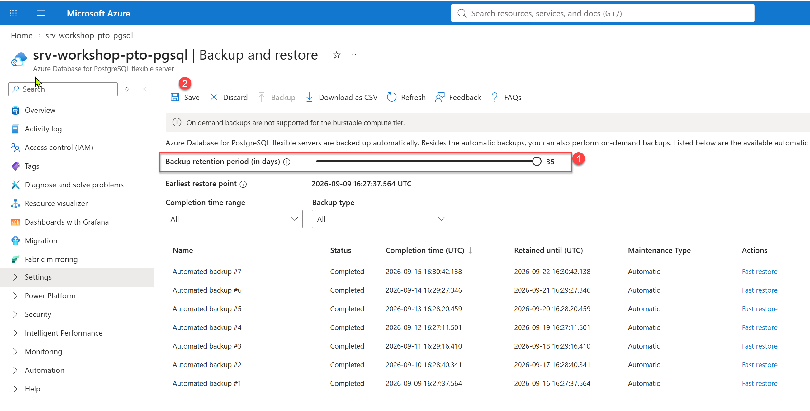
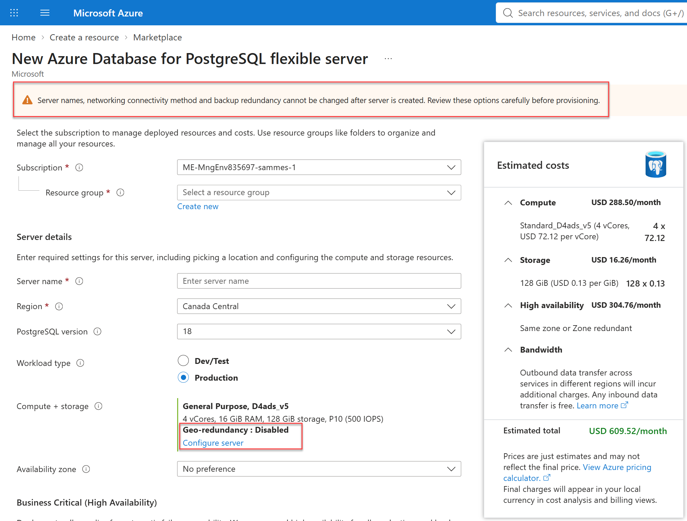
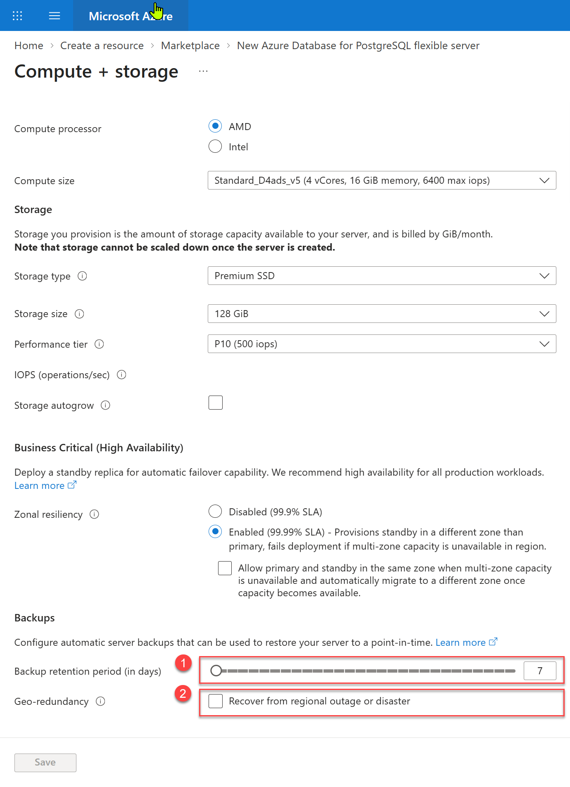
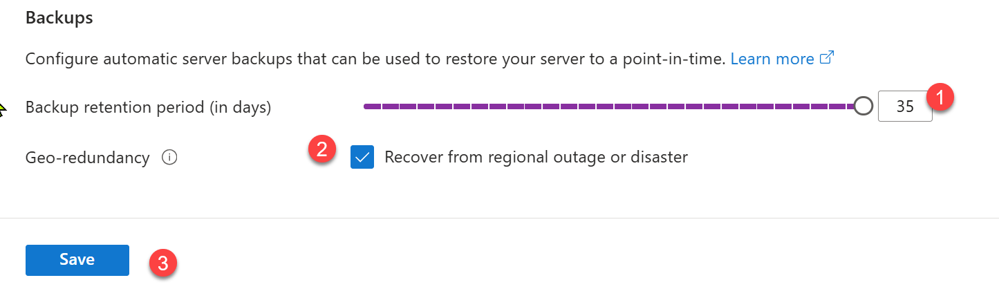

# Backup, Restore & Point-in-Time Restore
## Azure Database for PostgreSQL – Flexible Server
### Workshop for Oracle DBAs moving to Azure PostgreSQL

**Audience:** Experienced Oracle DBAs (RMAN, Data Guard, Flashback, ARCHIVELOG)</br>
**Goal:** Be able to explain, configure, test and defend a backup/recovery strategy on Azure Database for PostgreSQL – Flexible Server on day one.</br>


---

## 0. Mental model

> In Oracle you **own** the backup. In Azure PostgreSQL Flexible Server the platform **owns** the backup — you own the **retention policy, the redundancy choice, and the recovery drill.**

| What you did in Oracle | What happens here |
|---|---|
| Configure ARCHIVELOG mode, FRA sizing | Always on. WAL archiving is managed by the service. |
| Write and schedule RMAN full/incremental scripts | Automatic daily snapshot (first = full, subsequent = differential). Nothing to schedule. |
| RMAN `RESTORE DATABASE` + `RECOVER UNTIL TIME` | **Point-in-Time Restore (PITR)** — one portal/CLI action that deploys a **new server**. |
| `FLASHBACK DATABASE TO TIMESTAMP` (in place) | **No in-place rewind.** Restore creates a *new* server; you cut over or copy data back. |
| RMAN catalog, backup pieces on disk/tape you manage | Backups are opaque, encrypted (AES-256), and **not exportable**. Use `pg_dump`/`pg_restore` if you need a portable file. |
| Tape / long-term retention scripts | **Vaulted backups (LTR)** via Azure Backup vault — up to 10 years. |
| Data Guard standby | Read replicas / HA (zone-redundant or same-zone) — *availability*, not backup. |

**The single biggest culture shift to land early:** a restore does **not** overwrite the source server. Every restore is a **new server with a new name and new connection string**.

---

## 1. How operational backup actually works

### 1.1 What is captured
- **Snapshot backups of the data files** — storage-level snapshots, not a logical dump.
- **Transaction log (WAL) backups** — a WAL file is archived when it is filled and ready.
- Together these give you **any point in time** inside the retention window.

### 1.2 Frequency
| Item | Behavior |
|---|---|
| First snapshot | Immediately after server creation (full backup) |
| Subsequent snapshots | Once daily, differential |
| Idle server | Snapshots temporarily suspended if no database changed; a new snapshot is taken as soon as a change occurs |
| WAL backup | Variable — driven by workload and WAL fill rate |
| **Effective RPO** | **Up to ~5 minutes** |

> **Oracle analogy:** think "daily RMAN level-0/level-1 to an unmanaged FRA + continuous archive log shipping", with the archiver never falling behind because the platform owns it.

### 1.3 Retention
- **Default: 7 days. Configurable 7 → 35 days.**
- Changeable **after** creation (Settings → Compute + storage → Backup).
- Beyond 35 days requires **vaulted backups / LTR** (Section 5).

#### Current backup retention



#### Changing backup retention



#### Modifying and Saving backup retention

1 move the slider up to **35 days**</br>
2 **save**.</br>




### 1.4 Redundancy options

> ⚠️ **Common regret:** **Geo-redundant backup can only be selected when the server is created and cannot be changed afterwards.**</br> If cross-region recoverability is a requirement, it must be decided at provisioning time. (Retention days *can* be changed later; redundancy cannot.)


| Option | What it does | When it is chosen |
|---|---|---|
| **Zone-redundant** | 3 copies in the server's AZ + replication to another AZ; ~12 nines durability | Default in regions with availability zones |
| **Locally redundant (LRS)** | Multiple copies in the same datacenter; ~11 nines | Default in regions without AZs, and default for same-zone HA / no-HA servers |
| **Geo-redundant (GRS)** | Also replicated to the Azure paired region; ~16 nines; enables cross-region restore | **Opt-in at server creation only** |


#### Settings when creating new Flexible server



#### Changing backup retention at creation



#### Modifying backup retention and GeoRedundancy

1 move the slider up to **35 days**</br>
2 check the Geo-redundancy checkbox</br>
3 **save**.</br>





### 1.5 Cost model
- Backup storage **up to the provisioned storage size is included**; consumption beyond that is billed.
- Long retention + high change rate (heavy `UPDATE`/`DELETE`/index maintenance) inflates WAL and differential volume — the same physics as an oversized Oracle FRA.
- Monitor with the **Backup Storage Used** metric (server → Monitoring → Metrics).

---

## 2. Restore types — the decision table

| Restore type | Use it for | Oracle equivalent | Result |
|---|---|---|---|
| **Latest restore point (Now)** | Server-level logical corruption just discovered; fastest "current" copy | `RESTORE DATABASE; RECOVER DATABASE;` | New server, current as of ~now |
| **Custom restore point (PITR)** | "Someone ran DELETE without WHERE at 14:32" | `RECOVER DATABASE UNTIL TIME '...'` | New server as of the timestamp you pick |
| **Fast restore point (full backup only)** | Need a copy *quickly*, exact second doesn't matter | Restore to a backup set, no log apply | New server at the snapshot time — skips WAL replay, so it is the **fastest** option |
| **Geo-restore** | Regional outage / DR drill | Restore from off-site tape to another site | New server in the **paired region** (requires GRS chosen at creation) |
| **Vaulted / LTR restore** | Compliance, audit, ransomware, "give me March 2024" | Long-term tape retrieval | Restore **as files** to a storage container, then load into a server |
| **`pg_dump` / `pg_restore`** | Single table/schema, move across clouds/versions | Data Pump (`expdp`/`impdp`) | Logical, portable, object-level |

### 2.1 Critical constraints

1. **Restore always creates a NEW server.** There is no in-place restore and no "restore over the top". Plan the **cutover**: DNS/app connection string, firewall/VNet rules, parameters, roles/logins, extensions, PgBouncer setting, monitoring, HA re-enable.
2. **PITR is same-region**, except geo-restore, which targets the paired region.
3. **You cannot restore a single table with PITR.** Table-level recovery = restore a server to the timestamp, then `pg_dump -t` the table out and load it into production. (This is the equivalent of Oracle table-level RMAN recovery via an auxiliary instance — same pattern, fewer moving parts.)
4. **Earliest restore point** is bounded by the retention window; older backups are deleted automatically.
5. **Restores are not free and not instant** — restore time scales with data size and the amount of WAL to replay. This is exactly why the **Fast restore point** option exists.
6. Some settings are **not inherited** by the restored server the way you may expect — verify HA, redundancy, firewall rules, and parameters after the restore.

---

## 3. Hands-on: the core commands

### 3.1 Inspect current backup configuration

</br>

```powershell
# Az PowerShell path
Install-Module -Name Az.PostgreSql -Scope CurrentUser -Force   # first time only
Connect-AzAccount
Set-AzContext -Subscription "<subscription-id-or-name>"
```


> **Oracle analogy**: this is your sqlplus / rman target / connection step — except the "target" is the Azure control plane, not the database engine. None of these commands connect to Postgres itself; they talk to ARM. The only section that touches the database is 3.6.

#### Set your variables once:</br>

```powershell
$RG   = 'rg-pg-workshop'
$SRC  = 'pg-prod-01'
$TGT1  = 'pg-restore-01'
$TGT2  = 'pg-restore-02'
$TGT3  = 'pg-restore-03'
$TGT4  = 'pg-restore-04'
$TGT5  = 'pg-restore-05'
$LOC  = 'eastus2'
$PAIR = 'westus2'        # paired region, for geo-restore
$ADMIN = 'pgadmin'
$srv = Get-AzPostgreSqlFlexibleServer -ResourceGroupName $RG -Name $SRC
```
> note: we are using several $TGT variables, each one will be used for one restore operation. make sure to set them with different values, as Target for restore operations must be new Servers.
</br>

#### Inspect current backup configuration

```powershell
[pscustomobject]@{
    Server          = $srv.Name
    Location        = $srv.Location
    Version         = $srv.Version
    Sku             = $srv.SkuName
    StorageGb       = $srv.StorageSizeGb
    RetentionDays   = $srv.BackupRetentionDay
    GeoRedundant    = $srv.BackupGeoRedundantBackup
    EarliestRestore = $srv.BackupEarliestRestoreDate
} | Format-List
```

#### Inventory the whole estate at once — useful as a governance check before the workshop:

```powershell
Get-AzPostgreSqlFlexibleServer |
    Select-Object Name, Location,
        @{n='RetentionDays';e={$_.BackupRetentionDay}},
        @{n='GeoRedundant'; e={$_.BackupGeoRedundantBackup}},
        @{n='EarliestRestore';e={$_.BackupEarliestRestoreDate}} |
    Sort-Object RetentionDays |
    Format-Table -AutoSize
```

> **LIST BACKUP SUMMARY**. EarliestRestoreDate is your recovery window floor — the equivalent of asking "how far back does my FRA actually go?" Anything older is already deleted and unrecoverable.

### 3.2 Change retention (7–35 days)

```powershell
Update-AzPostgreSqlFlexibleServer `
    -ResourceGroupName $RG `
    -Name $SRC `
    -BackupRetentionDay 35

# Confirm it landed
(Get-AzPostgreSqlFlexibleServer -ResourceGroupName $RG -Name $SRC).BackupRetentionDay
```

#### Bulk-remediate every server still sitting on the 7-day default:

```powershell
Get-AzPostgreSqlFlexibleServer |
    Where-Object { $_.BackupRetentionDay -lt 14 } |
    ForEach-Object {
        Write-Host "Raising retention on $($_.Name) from $($_.BackupRetentionDay) to 35 days"
        Update-AzPostgreSqlFlexibleServer -ResourceGroupName $_.Id.Split('/')[4] `
                                          -Name $_.Name `
                                          -BackupRetentionDay 35
    }
```

> ⚠️ **Retention is the only backup property you can change after creation**. Backup redundancy (geo) is create-time only — no cmdlet or CLI flag will retrofit it. Raising retention increases billable backup storage beyond your provisioned storage size.

### 3.3 Point-in-time restore to a timestamp

```powershell
# Always build the timestamp explicitly in UTC
$restorePoint = [datetime]::SpecifyKind('2026-09-15T14:30:00', [System.DateTimeKind]::Utc)

Restore-AzPostgreSqlFlexibleServer `
    -ResourceGroupName $RG `
    -Name $TGT1 `
    -SourceServerName $SRC `
    -RestorePointInTime $restorePoint
```

> Use **UTC**. Record incident timestamps in UTC — mixing local time and UTC is the #1 cause of a "restored to the wrong minute" do-over.

#### Measure the restore — this is the number that becomes your documented **RTO**

```powershell
# Always build the timestamp explicitly in UTC
$sw = [System.Diagnostics.Stopwatch]::StartNew()

Restore-AzPostgreSqlFlexibleServer -ResourceGroupName $RG -Name $TGT2 `
                                   -SourceServerName $SRC `
                                   -RestorePointInTime $restorePoint
$sw.Stop()
"Restore completed in {0:N1} minutes" -f $sw.Elapsed.TotalMinutes
```

#### Long restores — hand it off and keep working:

```powershell
$job = Restore-AzPostgreSqlFlexibleServer -ResourceGroupName $RG -Name $TGT3 `
                                          -SourceServerName $SRC `
                                          -RestorePointInTime $restorePoint `
                                          -AsJob
$job | Wait-Job | Receive-Job
```

</br>

> This is **RECOVER DATABASE UNTIL TIME** — with two differences worth saying out loud to the room: there is no RESTORE step to run first, and the result is a brand-new server, not your source recovered in place. </br> ⚠️ **Always use UTC**. -RestorePointInTime takes a [DateTime]; if you pass an unqualified local-time string, PowerShell will interpret it with the kind of the machine you're on. SpecifyKind(...Utc) removes all ambiguity. Record incident timestamps in UTC from the start — mixing local time and UTC is the #1 cause of a "restored to the wrong minute" do-over.</br>

### 3.4 Restore to latest restore point

</br>

The Az cmdlet requires -RestorePointInTime, so "latest" is expressed as a few minutes ago — safely inside the **archived-WAL** window:
</br>

```powershell
$latest = (Get-Date).ToUniversalTime().AddMinutes(-5)

Restore-AzPostgreSqlFlexibleServer `
    -ResourceGroupName $RG `
    -Name $TGT4 `
    -SourceServerName $SRC `
    -RestorePointInTime $latest
```

</br>

> Why -5 minutes? **WAL** is archived as segments fill, so the true latest restore point trails "now" by up to ~5 minutes (your RPO). Asking for a timestamp in the future — or inside that trailing gap — fails. Fast restore point (snapshot only, no WAL replay — the fastest option) is a portal choice in the restore wizard; use it when speed matters more than the exact second.

### 3.5 Geo-restore to the paired region (GRS servers only)

</br>

**PowerShell (Az module)** — same cmdlet, **-UseGeoRestore** switch:
</br>

```powershell
# Confirm the source is actually geo-redundant BEFORE you rely on this in a drill
$srv = Get-AzPostgreSqlFlexibleServer -ResourceGroupName $RG -Name $SRC
if ($srv.BackupGeoRedundantBackup -ne 'Enabled') {
    throw "Server $SRC is NOT geo-redundant. Geo-restore is unavailable and cannot be enabled after creation."
}

$geoPoint = (Get-Date).ToUniversalTime().AddMinutes(-10)

Restore-AzPostgreSqlFlexibleServer `
    -ResourceGroupName $RG `
    -Name 'pg-dr-01' `
    -SourceServerName $SRC `
    -RestorePointInTime $geoPoint `
    -UseGeoRestore `
    -Sku 'Standard_D4s_v3' `
    -Tag @{ purpose = 'dr-drill'; owner = 'dba-team' }
```

</br>

> **This is your off-site tape restore to the DR site**. It works only if geo-redundant backup was selected when the source server was created. The guard clause above is deliberate — discovering GRS was never enabled during an actual regional outage is the worst possible time to find out. Restoring to a larger SKU (-Sku) shortens replay and validation; scale down after cutover.

### 3.6 Logical backup — the tool they already understand

</br>
These invoke the native PostgreSQL client tools, so the syntax is identical to what the team already knows — only the credential handling is PowerShell-specific.

```powershell
$SrcFqdn = "$SRC.postgres.database.azure.com"
$TgtFqdn = "$TGT5.postgres.database.azure.com"

# Supply the password to the client tools without putting it on the command line
$env:PGPASSWORD = (Read-Host -Prompt 'Postgres admin password' -AsSecureString |
                   ConvertFrom-SecureString -AsPlainText)

# Whole database, custom format (parallel-restorable)  -- like expdp
pg_dump -h $SrcFqdn -U $ADMIN -d salesdb -Fc -f salesdb.dump

# Single table only
pg_dump -h $SrcFqdn -U $ADMIN -d salesdb -Fc -t public.orders -f orders.dump

# Schema only / data only
pg_dump -h $SrcFqdn -U $ADMIN -d salesdb -Fc --schema-only -f salesdb_schema.dump
pg_dump -h $SrcFqdn -U $ADMIN -d salesdb -Fc --data-only   -f salesdb_data.dump

# Restore into the target, 4 parallel jobs  -- like impdp
pg_restore -h $TgtFqdn -U $ADMIN -d salesdb -j 4 orders.dump

# Inspect a dump without restoring it  -- like impdp SQLFILE=
pg_restore --list orders.dump

# Clean up the credential
Remove-Item Env:\PGPASSWORD
```


#### Timestamped dumps of several databases, with retention pruning:

</br>

```powershell
$BackupDir = 'C:\pgdumps'
$stamp     = (Get-Date).ToUniversalTime().ToString('yyyyMMdd-HHmmss')
New-Item -ItemType Directory -Path $BackupDir -Force | Out-Null

'salesdb','hrdb','inventorydb' | ForEach-Object {
    $out = Join-Path $BackupDir "$_-$stamp.dump"
    Write-Host "Dumping $_ -> $out"
    pg_dump -h $SrcFqdn -U $ADMIN -d $_ -Fc -f $out
    if ($LASTEXITCODE -ne 0) { Write-Warning "pg_dump FAILED for $_ (exit $LASTEXITCODE)" }
}

# Keep 14 days of local dumps
Get-ChildItem $BackupDir -Filter *.dump |
    Where-Object { $_.LastWriteTime -lt (Get-Date).AddDays(-14) } |
    Remove-Item -Force
```

</br>

> ⚠️ Always check $LASTEXITCODE after a native tool call — PowerShell will not throw on a pg_dump failure, so an unchecked loop happily produces a directory full of truncated dumps. That is the logical-backup equivalent of a Data Pump job that ended with errors nobody read.</br>
 **Remember** `pg_dump` is **not** your DR strategy — it has no PITR, no consistency across databases, and long runtimes at scale. It is your **object-level and portability** tool. Platform backup is your DR strategy.
</br>

---

## 4. OPTIONAL Lab exercises

### Lab 1 — Prove the RPO (20 min)

> **Objective**: demonstrate that Azure PostgreSQL Flexible Server can recover to an arbitrary second inside the retention window, and produce a measured **RTO** number for your own runbook.
</br>

> Oracle framing: this is the RECOVER DATABASE UNTIL TIME drill you've run a hundred times — except there is no RESTORE step, no channel allocation, and the recovered database arrives as a new server.

#### Lab variables (run once)

```powershell
$RG      = 'rg-pg-workshop'
$SRC     = 'pg-prod-01'
$TGT     = "pg-lab1-restore-$((Get-Date).ToString('MMddHHmm'))"   # unique name per attempt
$ADMIN   = 'pgadmin'
$DB      = 'labdb'
$SrcFqdn = "$SRC.postgres.database.azure.com"
$TgtFqdn = "$TGT.postgres.database.azure.com"

# Cache the password for psql / pg_dump for this session only
$env:PGPASSWORD = (Read-Host -Prompt 'Postgres admin password' -AsSecureString |
                   ConvertFrom-SecureString -AsPlainText)

# Sanity check: how far back can we actually go?
(Get-AzPostgreSqlFlexibleServer -ResourceGroupName $RG -Name $SRC).BackupEarliestRestoreDate
```

> If BackupEarliestRestoreDate is less than ~10 minutes old, the server was just created — wait for the first snapshot to complete before starting, or the restore will fail with "restore point out of range."

#### Step 1. Create a table and insert rows with `now()` timestamps in a loop for 5 minutes.

```sql
-- save this file as lab1-setup.sql
-- Lab 1: RPO proof table. 
DROP TABLE IF EXISTS rpo_test;

CREATE TABLE rpo_test (
    id          bigserial PRIMARY KEY,
    inserted_at timestamptz NOT NULL DEFAULT now(),   -- server time, UTC-aware
    batch_note  text        NOT NULL,
    payload     text        NOT NULL
);

CREATE INDEX ix_rpo_test_inserted_at ON rpo_test (inserted_at);

-- Confirm the server's clock and timezone -- this is the clock PITR uses
SELECT now() AS server_now,
       now() AT TIME ZONE 'UTC' AS server_now_utc,
       current_setting('TimeZone') AS server_timezone;
```

##### Run it with PowerShell</br>

```powershell
psql -h $SrcFqdn -U $ADMIN -d $DB -f .\lab1-setup.sql
```

##### PowerShell - the insert loop (phase 1, 5 minutes)

```powershell
$phase1End = (Get-Date).AddMinutes(5)
$i = 0

while ((Get-Date) -lt $phase1End) {
    $i++
    psql -h $SrcFqdn -U $ADMIN -d $DB -q -c @"
INSERT INTO rpo_test (batch_note, payload)
SELECT 'PHASE1', repeat(md5(random()::text), 4)
FROM generate_series(1, 200);
"@
    if ($LASTEXITCODE -ne 0) { Write-Warning "Insert batch $i failed (exit $LASTEXITCODE)" }
    Start-Sleep -Seconds 5
}

Write-Host "Phase 1 complete: $i batches inserted." -ForegroundColor Green
```

> Each batch writes ~200 rows of random text. The volume matters less than the continuity — you need a steady WAL stream so there is something for PITR to replay.

#### Step 2. Simulate the disaster: `DROP TABLE` (or `DELETE` with no `WHERE`).

</br>
Capture **T** from the database server, not your laptop. Clock skew between a workstation and the service is exactly the kind of error this lab exists to surface

```powershell
# T = the recovery target. Read it from the server, in UTC.
$T = psql -h $SrcFqdn -U $ADMIN -d $DB -t -A -c "SELECT to_char(now() AT TIME ZONE 'UTC','YYYY-MM-DD HH24:MI:SS');"
$T = $T.Trim()

$restorePoint = [datetime]::SpecifyKind([datetime]::ParseExact($T,'yyyy-MM-dd HH:mm:ss',$null),
                                        [System.DateTimeKind]::Utc)

Write-Host "RECOVERY TARGET T (UTC): $($restorePoint.ToString('o'))" -ForegroundColor Cyan

# Record the row count as of T -- this is what the restore must reproduce
$countAtT = psql -h $SrcFqdn -U $ADMIN -d $DB -t -A -c "SELECT count(*) FROM rpo_test;"
Write-Host "Rows at T: $countAtT"

# Persist the evidence so it survives a closed shell
[pscustomobject]@{ T = $restorePoint.ToString('o'); RowsAtT = $countAtT } |
    Export-Csv .\lab1-evidence.csv -NoTypeInformation
```

##### Phase 2 — 5 more minutes of inserts (the data that must NOT survive):

```powershell
$phase2End = (Get-Date).AddMinutes(5)
$j = 0

while ((Get-Date) -lt $phase2End) {
    $j++
    psql -h $SrcFqdn -U $ADMIN -d $DB -q -c @"
INSERT INTO rpo_test (batch_note, payload)
SELECT 'PHASE2-AFTER-T', repeat(md5(random()::text), 4)
FROM generate_series(1, 200);
"@
    Start-Sleep -Seconds 5
}

$countAfter = psql -h $SrcFqdn -U $ADMIN -d $DB -t -A -c "SELECT count(*) FROM rpo_test;"
Write-Host "Rows now (after T): $countAfter  |  Rows at T was: $countAtT" -ForegroundColor Yellow
```

> The **PHASE2-AFTER-T** marker is the whole point — it gives you a visible, queryable label for data that must be absent from the restored copy. Never rely on row counts alone to judge a recovery.

#### Step 3. Simulate the disaster

</br>
Pick one. DROP TABLE is the more instructive choice for Oracle DBAs because it has no Flashback Drop equivalent — there is no recycle bin to pull it back from.

```powershell
# Option A -- DDL disaster (no recycle bin, no FLASHBACK DROP)
psql -h $SrcFqdn -U $ADMIN -d $DB -c "DROP TABLE rpo_test;"

# Option B -- DML disaster: the classic DELETE with no WHERE
# psql -h $SrcFqdn -U $ADMIN -d $DB -c "DELETE FROM rpo_test;"

# Confirm the damage
psql -h $SrcFqdn -U $ADMIN -d $DB -c "\dt rpo_test"
```

> Discussion prompt (2 min): in Oracle, which of these would Flashback have saved you from, and at what cost? Here, both have exactly one answer — PITR. Note also that HA and read replicas would have replicated this DROP faithfully within milliseconds.

#### Step 4. Restore with `--restore-time T`

```powershell
$sw = [System.Diagnostics.Stopwatch]::StartNew()

Restore-AzPostgreSqlFlexibleServer `
    -ResourceGroupName $RG `
    -Name $TGT `
    -SourceServerName $SRC `
    -RestorePointInTime $restorePoint

$sw.Stop()
Write-Host ("Restore completed in {0:N1} minutes" -f $sw.Elapsed.TotalMinutes) -ForegroundColor Green
```

> While it runs: **the source server is untouched and still online. Nothing was overwritten. That is the single largest behavioral difference from an RMAN in-place recovery.**

#### Step 5. Connect to the new server and confirm the table contains rows **up to T and nothing after**.

```powershell
# The restored server has a NEW FQDN -- the connection string changed
$TgtFqdn = "$TGT.postgres.database.azure.com"

# Firewall rule may be needed before you can connect
$myIp = (Invoke-RestMethod '`\[unsafe link removed: hxxps://api.ipify.org?format=json'\).ip\]`
New-AzPostgreSqlFlexibleServerFirewallRule -ResourceGroupName $RG -ServerName $TGT `
    -Name 'lab-client' -StartIPAddress $myIp -EndIPAddress $myIp
```

</br>

##### Save this script as: lab1-validate.sql</br>

```sql
-- 1. The table exists again -- the DROP was undone
SELECT count(*) AS total_rows FROM rpo_test;

-- 2. THE PROOF: phase 2 rows must be zero
SELECT batch_note, count(*) AS rows
FROM rpo_test
GROUP BY batch_note
ORDER BY batch_note;

-- 3. The newest surviving row must sit at or just before T
SELECT max(inserted_at) AT TIME ZONE 'UTC' AS newest_row_utc,
       min(inserted_at) AT TIME ZONE 'UTC' AS oldest_row_utc
FROM rpo_test;

-- 4. Explicit pass/fail assertion
SELECT CASE
         WHEN count(*) = 0 THEN 'PASS - no post-T data present'
         ELSE 'FAIL - ' || count(*) || ' rows from after T leaked into the restore'
       END AS pitr_verdict
FROM rpo_test
WHERE batch_note = 'PHASE2-AFTER-T';
```

##### execute the script

```powershell
psql -h $TgtFqdn -U $ADMIN -d $DB -f .\lab1-validate.sql
```
> Expected result: PHASE1 rows present, PHASE2-AFTER-T count zero, newest_row_utc at or fractionally before T, verdict PASS. 
> 
> If a handful of post-T rows appear, you restored to a slightly later point than intended — almost always a timezone or clock-skew error in how T was captured. That is a finding, not a failure: it is precisely why Step 2 reads the clock from the server.

#### Step 6. Record: wall-clock restore duration vs. database size. *This becomes your RTO evidence.*

```powershell
$srcInfo = Get-AzPostgreSqlFlexibleServer -ResourceGroupName $RG -Name $SRC

$result = [pscustomobject]@{
    RunDateUtc        = (Get-Date).ToUniversalTime().ToString('o')
    SourceServer      = $SRC
    RestoredServer    = $TGT
    DatabaseSizeGb    = $srcInfo.StorageSizeGb
    RetentionDays     = $srcInfo.BackupRetentionDay
    GeoRedundant      = $srcInfo.BackupGeoRedundantBackup
    RecoveryTargetUtc = $restorePoint.ToString('o')
    RowsAtT           = $countAtT
    RowsBeforeFailure = $countAfter
    RestoreMinutes    = [math]::Round($sw.Elapsed.TotalMinutes,1)
    Operator          = $env:USERNAME
}

$result | Format-List
$result | Export-Csv .\lab1-rto-evidence.csv -NoTypeInformation -Append
Write-Host "Evidence appended to lab1-rto-evidence.csv" -ForegroundColor Green
```


> Closing discussion (5 min):
> Restore time is driven by data size plus WAL volume to replay — it is not a fixed SLA. This measured number, not a vendor figure, is what belongs in your runbook.
> Restoring to a point further from the last snapshot means more WAL to replay and a longer RTO. This is the trade-off Fast restore point buys out.
> Your RTO is not complete until you add cutover time — connection strings, firewall, parameters, roles, extensions, HA re-enable (Section 7 checklist).

#### Step 7 - Clean up


```powershell
Remove-AzPostgreSqlFlexibleServer -ResourceGroupName $RG -Name $TGT -Force
Remove-Item Env:\PGPASSWORD
```

---

## 6. Oracle → PostgreSQL translation glossary

| Oracle | Azure PostgreSQL Flexible Server |
|---|---|
| ARCHIVELOG mode | WAL archiving — always on, platform-managed |
| Archived redo log | WAL segment |
| SCN | LSN (Log Sequence Number) |
| Control file | `pg_control` + platform metadata (not user-managed) |
| Fast Recovery Area (FRA) | Managed backup storage (size it via retention, not a quota) |
| RMAN backupset / image copy | Platform snapshot (opaque, not exportable) |
| RMAN `RECOVER UNTIL TIME` | PITR with custom restore point |
| `FLASHBACK DATABASE` | *No equivalent* — restore to a new server |
| Flashback Query / `AS OF TIMESTAMP` | *No equivalent* — restore then query the copy |
| Flashback Drop / recycle bin | *No equivalent* — DDL is not recoverable in place; PITR is the answer |
| Data Pump `expdp`/`impdp` | `pg_dump` / `pg_restore` |
| RMAN catalog / `LIST BACKUP` | Portal *Backup and restore* blade; earliest restore point; Backup vault jobs |
| Data Guard | HA (zone-redundant/same-zone) + read replicas |
| Tablespace point-in-time recovery | Restore server → `pg_dump -t` → load |
| `V$RMAN_STATUS` | Backup Storage Used metric; Backup center jobs |

---

## 7. Post-restore cutover runbook (hand out as a template)

After **every** restore, before declaring recovery complete:

- [ ] Server name and FQDN are new → update **application connection strings / DNS / key vault secrets**
- [ ] **Networking**: VNet integration, private endpoint, firewall rules
- [ ] **Server parameters** — verify against the source baseline
- [ ] **Roles, users, passwords** and `pg_hba`-equivalent access rules
- [ ] **Extensions** (`shared_preload_libraries`, `CREATE EXTENSION`) present and correct
- [ ] **High availability** re-enabled if required (restores land without HA unless configured)
- [ ] **Backup retention & redundancy** reconfigured on the new server (GRS is create-time only — decide now)
- [ ] **Read replicas** recreated
- [ ] **Monitoring, alerts, diagnostic settings, Defender** re-attached
- [ ] **Maintenance window** and tags reapplied
- [ ] `ANALYZE` the restored database before opening to the workload
- [ ] Validate row counts / application smoke test **before** cutting traffic over
- [ ] Decide fate of the source server (retain for forensics, then delete to stop charges)

---

## 8. Design decisions to make before go-live

| Decision | Options | Guidance |
|---|---|---|
| Backup retention | 7–35 days | Set to the longest incident-detection window you realistically have. 7 days is rarely enough for slow-burn logical corruption. |
| Backup redundancy | LRS / ZRS / **GRS** | **Decide at creation.** If there is any DR/regional requirement, choose geo-redundant — it cannot be added later. |
| Long-term retention | None / vaulted LTR | Any regulatory retention > 35 days, or ransomware-isolation requirement → vaulted backups. |
| Restore target sizing | Same / larger SKU | Restore to a larger compute tier to shorten replay and validation, then scale down. |
| Recovery drill cadence | Quarterly minimum | An untested restore is a hypothesis. Measure RTO and publish it. |
| Logical export | Optional | Keep periodic `pg_dump` of small critical schemas for fast object-level fixes. |

---

## 9. FAQ — the questions Oracle DBAs always ask

**"Can I restore over the existing server?"** No. Every restore produces a new server; cutover is your responsibility. Plan for it.

**"Can I get one table back without a full restore?"** Not directly. Restore the server to the timestamp, then `pg_dump -t` that table and load it into production.

**"Can I download the backup files?"** No — platform backups are encrypted and not exportable, and cannot be used to build a server outside the service. Use `pg_dump`/`pg_restore` for portable copies.

**"Can I take a manual backup before a release?"** Yes — trigger an on-demand backup from the portal (**Backup and restore → Backup now**, with a descriptive name such as `pre-release-v2-1-0`). This is the equivalent of your pre-change RMAN full.

**"Do I need to manage archive log deletion?"** No. WAL retention is governed by your backup retention setting; the platform manages the lifecycle.

**"What's my RPO and RTO?"** RPO: up to ~5 minutes (WAL archive cadence). RTO: not a fixed number — it depends on data size and WAL replay volume. **Measure it in a drill and document your own number.**

**"Is HA a backup?"** No. HA and read replicas protect against infrastructure failure; they faithfully replicate a `DELETE` with no `WHERE`. Only backups protect against logical corruption.

**"What if the region is down?"** Geo-restore into the paired region — **only if geo-redundant backup was enabled at server creation.**

---

## 10. Key takeaways (closing slide)

1. Backups are automatic — **your job is retention, redundancy, and drills.**
2. **Restore = new server.** Rehearse the cutover, not just the restore.
3. **Geo-redundancy is a create-time decision.** There is no retrofit.
4. **35 days is the operational ceiling.** Compliance retention lives in a Backup vault, up to 10 years.
5. There is **no Flashback**. PITR + `pg_dump` cover the same ground with different ergonomics.
6. **Measure your RTO** in a lab, publish it, and re-test quarterly.

---

## Reference documentation

- Backup and restore concepts — https://learn.microsoft.com/en-us/azure/postgresql/backup-restore/concepts-backup-restore
- Restore to latest restore point — https://learn.microsoft.com/en-us/azure/postgresql/backup-restore/how-to-restore-latest-restore-point
- Azure Backup for PostgreSQL Flexible Server (LTR) overview — https://learn.microsoft.com/en-us/azure/backup/backup-azure-database-postgresql-flex-overview
- Configure vaulted backup — https://learn.microsoft.com/en-us/azure/backup/backup-azure-database-postgresql-flex
