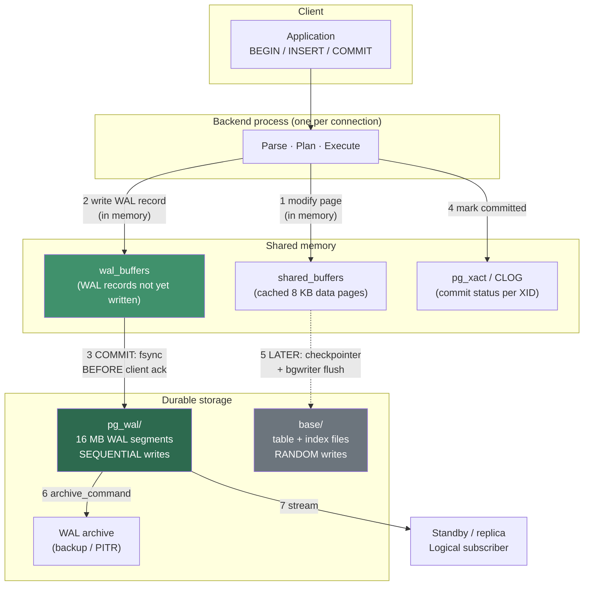
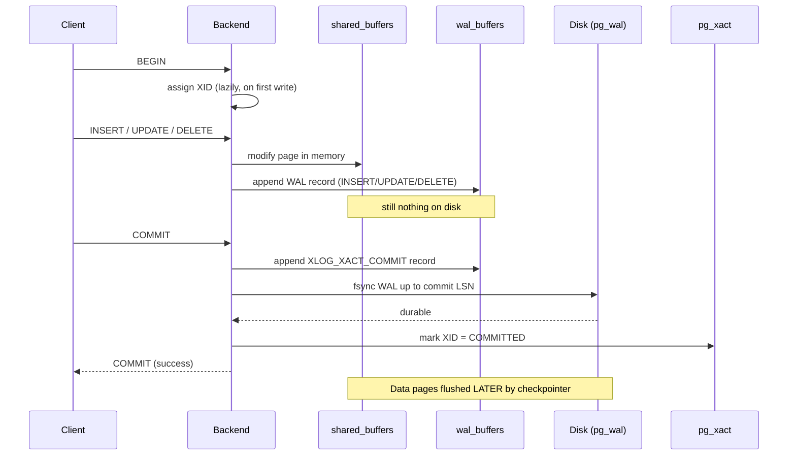
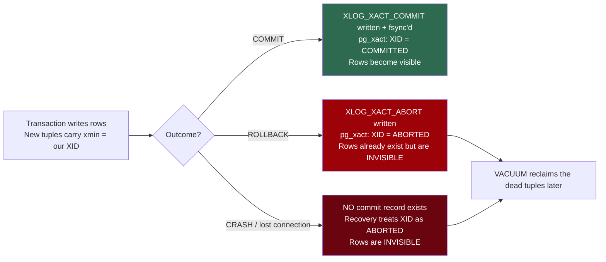
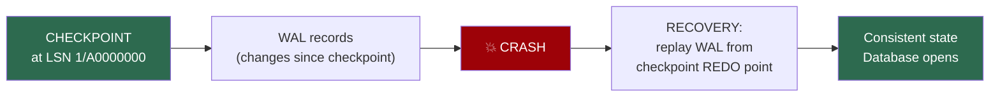
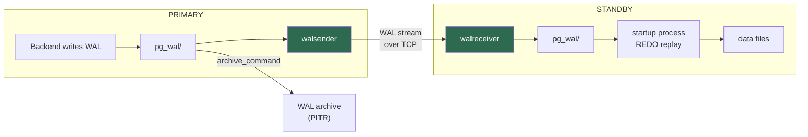
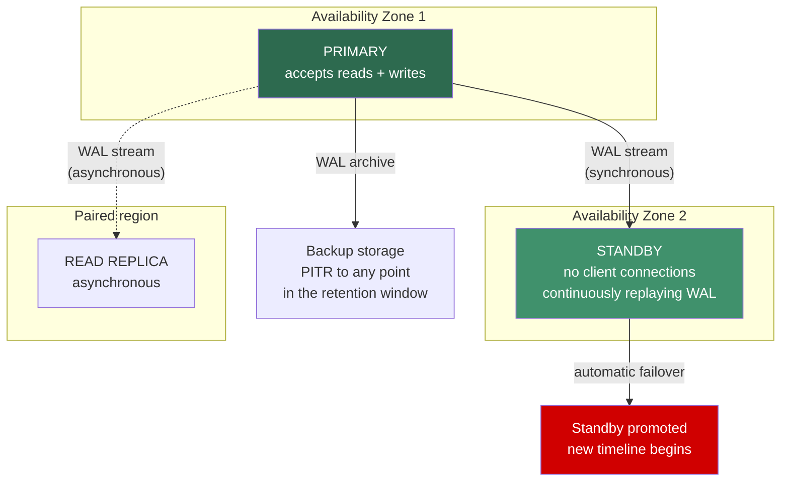

# PostgreSQL Write-Ahead Log (WAL)

## Architecture · transaction outcomes · replication · high availability

> **Diagrams in this document** are written as **Mermaid** code blocks plus ASCII fallbacks, so they render in GitHub, VS Code, Azure DevOps and most Markdown viewers — and stay editable as text. If your viewer does not render Mermaid, the ASCII diagram immediately below each one carries the same information.

---

## 0. The 60-second summary

> **Write-Ahead Rule:** *a change is never written to the data files until the log record describing that change is safely on durable storage.*

Every behavior in this document follows from that single sentence.

| Question | Answer |
|---|---|
| **Why does WAL exist?** | To make `COMMIT` durable **without** waiting for random writes to data files |
| **What does `COMMIT` actually guarantee?** | The commit record is **flushed to disk** — not that the table pages are |
| **What happens on `ROLLBACK`?** | Almost nothing. An abort record is written; **PostgreSQL has no UNDO log** |
| **What happens if the connection dies mid-transaction?** | The absence of a commit record **is** the abort. Recovery needs no work |
| **Does WAL drive replication?** | ✅ **Yes** — physical *and* logical replication are both WAL consumers |
| **Does WAL drive HA and PITR?** | ✅ Yes — the standby replays WAL; PITR replays archived WAL |
| **Biggest operational risk?** | **An inactive replication slot** pinning WAL until the disk fills |

**The line that surprises Oracle DBAs most:**

> **PostgreSQL has no undo tablespace and no rollback segments.** A `ROLLBACK` of a 10-million-row `DELETE` is **as fast as a `ROLLBACK` of nothing at all**, because the work of removing the dead row versions is deferred to `VACUUM`. In Oracle, that rollback would grind through undo for minutes.

---

# PART I — Architecture

## 1. Where WAL sits



**ASCII fallback:**

```
   CLIENT
     |  BEGIN / INSERT / UPDATE / COMMIT
     v
  BACKEND PROCESS
     |
     |--(1)--> shared_buffers    [modify the 8 KB page IN MEMORY -- fast]
     |--(2)--> wal_buffers       [write the WAL record IN MEMORY -- fast]
     |
     |--(3) COMMIT -------------> fsync wal_buffers -> pg_wal/*  [SEQUENTIAL]
     |                              ^^^^^^^^^^^^^^^^^^^^^^^^^^^
     |                              THE ONLY DISK WAIT ON COMMIT
     |--(4)--> pg_xact           [record XID = committed]
     v
  CLIENT GETS "COMMIT" <-- returns here. Data files NOT yet written.

  LATER, ASYNCHRONOUSLY:
     checkpointer / bgwriter ----> base/<datafiles>   [RANDOM writes]
     archive_command ------------> WAL archive        [backup, PITR]
     walsender ------------------> standby / replica  [HA, read replicas]
```

### 1.1 Why this design is fast

| | Without WAL | With WAL |
|---|---|---|
| Work at `COMMIT` | Flush every modified page — **random** I/O scattered across the disk | Flush one contiguous log stream — **sequential** I/O |
| Pages modified 100 times | 100 random writes | 1 write at checkpoint |
| Durability | Requires the data files to be current | Requires only the log to be current |

> **The core trade:** WAL converts many random writes into one sequential write, and defers the random writes to a moment when they can be batched. That is the entire performance argument.

## 2. LSN — the address of everything

A **Log Sequence Number** is a byte offset into the infinite WAL stream, printed as `XXXXXXXX/XXXXXXXX` in hex.

```sql
SELECT pg_current_wal_lsn()        AS current_write_position,
       pg_current_wal_insert_lsn() AS current_insert_position,
       pg_current_wal_flush_lsn()  AS flushed_to_disk;
```

| Function | Means |
|---|---|
| `pg_current_wal_insert_lsn()` | Furthest point written into **wal_buffers** (memory) |
| `pg_current_wal_lsn()` | Furthest point written to the **OS** |
| `pg_current_wal_flush_lsn()` | Furthest point **fsync'd to durable storage** ← *this is what durability means* |

```sql
-- LSNs subtract like numbers -- this is how ALL lag is measured
SELECT pg_current_wal_lsn() - '0/0'::pg_lsn AS bytes_since_start;

SELECT pg_size_pretty(
    pg_current_wal_lsn() - pg_current_wal_insert_lsn()
) AS unflushed_bytes;
```

> **Every replication-lag metric in PostgreSQL is an LSN subtraction.** Once you internalize that, `pg_stat_replication` stops being mysterious.

## 3. WAL files on disk

```sql
-- Which physical file holds the current position?
SELECT pg_current_wal_lsn()                        AS lsn,
       pg_walfile_name(pg_current_wal_lsn())       AS wal_file;
```

**Filename anatomy** — 24 hex characters:

```
0000000100000002000000A3
[------][------][------]
   |       |       |
   |       |       +--- segment number within the logical file (00 - FF)
   |       +----------- logical WAL file number (high 32 bits of LSN)
   +------------------- TIMELINE ID
```

> **The timeline ID matters for PITR.** Every time you restore to a point in time and resume writing, PostgreSQL increments the timeline so the new history cannot be confused with the old one. A jump from `00000001...` to `00000002...` means a recovery happened.

```sql
-- Size and count of WAL currently on disk
SELECT count(*)                          AS wal_files,
       pg_size_pretty(sum(size))         AS total_size
FROM pg_ls_waldir();

-- Segment size (16 MB default)
SHOW wal_segment_size;
```

---

# PART II — Transaction outcomes

## 4. What actually happens on COMMIT



**The critical sequence, stated plainly:**

1. Page changed **in memory** (`shared_buffers`)
2. WAL record written **in memory** (`wal_buffers`)
3. On `COMMIT` — a commit record is appended and **WAL is fsync'd to disk**
4. Transaction status recorded in `pg_xact`
5. **Client is told the commit succeeded**
6. **Much later**, the checkpointer writes the data pages

> ⚠️ **Step 5 happens before step 6.** If the server loses power between them, the data files are stale — but WAL contains everything needed to redo the change. That is crash recovery (§7), and it is why the commit is genuinely durable despite the data files being behind.

### 4.1 Demo — watch WAL grow with a commit

```sql
CREATE SCHEMA IF NOT EXISTS wallab;
SET search_path TO wallab, public;

DROP TABLE IF EXISTS wal_demo;
CREATE TABLE wal_demo (id bigserial PRIMARY KEY, payload text);
```

```sql
-- Measure WAL generated by a transaction
SELECT pg_current_wal_lsn() AS lsn_before \gset

BEGIN;
INSERT INTO wal_demo (payload)
SELECT repeat('x', 200) FROM generate_series(1, 100000);
COMMIT;

SELECT pg_size_pretty(pg_current_wal_lsn() - :'lsn_before'::pg_lsn) AS wal_generated;
```

```sql
-- Per-statement WAL accounting -- PG 13+
EXPLAIN (ANALYZE, BUFFERS, WAL, COSTS OFF)
INSERT INTO wal_demo (payload)
SELECT repeat('y', 200) FROM generate_series(1, 50000);
```

> **👁 What to look for in this plan**
>
> The `WAL` option adds a line most people have never seen:
>
> ```
> WAL: records=50123  fpi=412  bytes=9847291
> ```
>
> | Field | Means |
> |---|---|
> | **`records`** | WAL records emitted. Roughly one per row plus index maintenance |
> | **`fpi`** | ⚠️ **Full Page Images** — whole 8 KB pages written to WAL (§8). A high count means you are just after a checkpoint |
> | **`bytes`** | Total WAL volume. **This is what drives your archive size, replication bandwidth, and backup storage bill** |
>
> **Run the same statement twice.** The second run usually shows far fewer `fpi` — because those pages were already full-page-imaged after the last checkpoint. **That single observation explains why write performance appears to fluctuate on a cycle.**

### 4.2 Comparing WAL cost of different operations

```sql
-- Helper to measure any statement
CREATE OR REPLACE FUNCTION wallab.wal_cost(p_sql text)
RETURNS text LANGUAGE plpgsql AS $$
DECLARE
    v_before pg_lsn;
BEGIN
    v_before := pg_current_wal_lsn();
    EXECUTE p_sql;
    RETURN pg_size_pretty(pg_current_wal_lsn() - v_before);
END $$;
```

```sql
SELECT 'INSERT 10k'  AS operation,
       wallab.wal_cost($$INSERT INTO wal_demo (payload)
                         SELECT repeat('a',200) FROM generate_series(1,10000)$$) AS wal
UNION ALL
SELECT 'UPDATE 10k (non-indexed col)',
       wallab.wal_cost($$UPDATE wal_demo SET payload = repeat('b',200)
                         WHERE id <= 10000$$)
UNION ALL
SELECT 'DELETE 10k',
       wallab.wal_cost($$DELETE FROM wal_demo WHERE id <= 10000$$)
UNION ALL
SELECT 'TRUNCATE',
       wallab.wal_cost($$TRUNCATE wal_demo$$);
```

> **Expected result and why it matters:** `UPDATE` generates **the most** WAL — MVCC writes an entirely new row version plus index entries, and the old version still has to be logged as dead. `TRUNCATE` generates almost **none** — it is a catalog operation plus a file truncation.
>
> **This is the WAL argument for partitioning:** `DROP TABLE <partition>` costs near-zero WAL; `DELETE` of the same rows costs more WAL than the data itself.

## 5. What happens on ROLLBACK



**ASCII fallback:**

```
  Transaction writes rows  -->  tuples physically exist with xmin = XID
            |
     +------+------+--------------------+
     |             |                    |
  COMMIT       ROLLBACK          CRASH / CONNECTION LOST
     |             |                    |
  commit       abort record       NO record at all
  record       written            (absence == abort)
  + FSYNC      (fsync optional)
     |             |                    |
  pg_xact:     pg_xact:            recovery infers
  COMMITTED    ABORTED             ABORTED
     |             |                    |
  VISIBLE      INVISIBLE            INVISIBLE
                   |                    |
                   +--------+-----------+
                            v
                   VACUUM reclaims space later
```

### 5.1 The key insight: there is no UNDO

**PostgreSQL never "undoes" anything.** A rolled-back transaction's rows are already written to the table — they are simply **never visible**, because `pg_xact` records the XID as aborted and MVCC filters them out.

```sql
-- Demo: rollback is instant regardless of volume
\timing on

BEGIN;
INSERT INTO wal_demo (payload)
SELECT repeat('z', 500) FROM generate_series(1, 500000);
ROLLBACK;     -- milliseconds, no matter how much was inserted
```

```sql
-- The rows are gone logically...
SELECT count(*) FROM wal_demo;

-- ...but the SPACE is still occupied until VACUUM runs
SELECT n_live_tup, n_dead_tup,
       pg_size_pretty(pg_total_relation_size('wal_demo')) AS size
FROM pg_stat_user_tables WHERE relname = 'wal_demo';

VACUUM (ANALYZE, VERBOSE) wal_demo;   -- NOW the space becomes reusable
```

| | **PostgreSQL** | **Oracle** | **SQL Server** |
|---|---|---|---|
| Rollback mechanism | Mark XID aborted; rows stay as dead tuples | **Apply undo** — physically reverse each change | **Apply transaction-log undo** |
| Rollback duration | ⚡ **Constant time** — instant | ⏳ Proportional to work done | ⏳ Proportional to work done |
| Cleanup | **`VACUUM`**, later | Undo expiry, automatic | Ghost cleanup, automatic |
| Cost of a huge rollback | Free now, bloat later | Expensive now | Expensive now |

> **The trade is explicit:** PostgreSQL gives you instant rollback and pays for it with **bloat plus a vacuum obligation**. Oracle pays up front and has no vacuum. Neither is free — they just bill you at different times. Every "why do I need VACUUM?" conversation traces back to this design choice.

### 5.2 Lost or broken connections — what really happens

```sql
-- Session 1: start work and abandon it
BEGIN;
INSERT INTO wal_demo (payload) VALUES ('will never be committed');
-- Now KILL the connection: close the client, pull the network, kill -9 the backend
```

```sql
-- Session 2: find abandoned transactions
SELECT pid,
       state,
       now() - xact_start        AS transaction_age,
       now() - state_change      AS idle_duration,
       backend_xid,
       left(query, 60)           AS last_query
FROM pg_stat_activity
WHERE state IN ('idle in transaction', 'idle in transaction (aborted)')
ORDER BY xact_start;
```

**What PostgreSQL does, in order:**

1. The backend process **dies** (or the postmaster detects the broken socket).
2. **No `XLOG_XACT_COMMIT` record was ever written.**
3. On the next startup — or immediately, if only the one backend died — the XID is treated as **aborted**.
4. The rows written by that transaction exist on disk but are **permanently invisible**.
5. `VACUUM` reclaims them.

> **The elegance of the design:** *nothing needs to be undone, and nothing needs to be cleaned up urgently.* **The absence of a commit record IS the abort.** An abort record is written when PostgreSQL gets the chance, but it is an optimization, not a requirement — which is why an abort record does not need an `fsync` the way a commit record does.

> ⚠️ **The real danger of an abandoned transaction is not WAL — it is `idle in transaction`.** An open transaction holds its XID, which **blocks `VACUUM` from cleaning any dead tuple newer than it**, anywhere in the database. Bloat accumulates, and in the worst case transaction-ID wraparound approaches.

```sql
-- Defend against it -- set these on the server
ALTER SYSTEM SET idle_in_transaction_session_timeout = '10min';
ALTER SYSTEM SET statement_timeout = '0';          -- per-workload, set carefully
SELECT pg_reload_conf();
```

```sql
-- Find the oldest transaction holding back vacuum
SELECT pid, state,
       now() - xact_start AS age,
       backend_xid, backend_xmin,
       left(query, 80) AS query
FROM pg_stat_activity
WHERE backend_xmin IS NOT NULL
ORDER BY age_of_xid_or_null(backend_xmin) DESC NULLS LAST
LIMIT 10;
```

> 💡 On Azure Flexible Server, set `idle_in_transaction_session_timeout` under **Settings → Server parameters** (dynamic — no restart).

## 6. Durability control — `synchronous_commit`

```sql
SHOW synchronous_commit;   -- 'on' by default
```

| Setting | `COMMIT` returns after… | Data-loss window | Corruption risk |
|---|---|---|---|
| **`on`** *(default)* | Local WAL fsync **+** sync standby flush (if configured) | **Zero** | None |
| **`remote_apply`** | Standby has **replayed** it (visible to readers there) | Zero | None |
| **`remote_write`** | Standby's OS has it, not necessarily fsync'd | Standby OS crash | None |
| **`local`** | Local WAL fsync only — ignores standbys | Local disk loss | None |
| **`off`** | ⚠️ WAL still in memory | **Up to `3 × wal_writer_delay`** (~600 ms) | ✅ **None** |

> ⚠️ **`synchronous_commit = off` is safe but lossy — an important distinction.** You can lose the last few hundred milliseconds of *committed* transactions in a crash, but the database will **never be corrupt or inconsistent**. That is fundamentally different from `fsync = off`, which risks genuine corruption and must never be used in production.

```sql
-- Per-transaction -- the right granularity for bulk loads
BEGIN;
SET LOCAL synchronous_commit = off;
INSERT INTO wal_demo (payload)
SELECT repeat('q',100) FROM generate_series(1,200000);
COMMIT;
```

```sql
-- Measure the difference
\timing on
SET synchronous_commit = on;
DO $$ BEGIN FOR i IN 1..2000 LOOP
  INSERT INTO wal_demo (payload) VALUES ('sync'); COMMIT; END LOOP; END $$;

SET synchronous_commit = off;
DO $$ BEGIN FOR i IN 1..2000 LOOP
  INSERT INTO wal_demo (payload) VALUES ('async'); COMMIT; END LOOP; END $$;

RESET synchronous_commit;
```

> **Expected result:** many small commits are dramatically faster with `synchronous_commit = off`, because each one no longer waits for an fsync. **The pattern to adopt:** leave it `on` globally, and use `SET LOCAL synchronous_commit = off` for bulk loads, ETL, and anything reloadable.

---

# PART III — Checkpoints, recovery, full-page writes

## 7. Checkpoints and crash recovery



**A checkpoint:**
1. Writes every dirty page in `shared_buffers` to the data files
2. `fsync`s the data files
3. Writes a checkpoint record to WAL
4. **Lets PostgreSQL recycle WAL older than the checkpoint**

**Crash recovery** replays WAL forward from the last checkpoint's REDO point. That is why **checkpoint frequency and recovery time are directly related**: frequent checkpoints = short recovery but more I/O; infrequent = less I/O but longer recovery.

```sql
-- Key checkpoint settings
SELECT name, setting, unit, short_desc
FROM pg_settings
WHERE name IN ('checkpoint_timeout','max_wal_size','min_wal_size',
               'checkpoint_completion_target','wal_buffers','wal_writer_delay',
               'full_page_writes','wal_compression','wal_level')
ORDER BY name;
```

```sql
-- Checkpoint activity -- PG 17+ uses pg_stat_checkpointer
SELECT * FROM pg_stat_bgwriter;     -- PG 16 and earlier
-- SELECT * FROM pg_stat_checkpointer;   -- PG 17+
```

> **👁 What to look for**
>
> | Column | What it tells you |
> |---|---|
> | **`checkpoints_timed`** | Scheduled checkpoints — **you want these to dominate** |
> | **`checkpoints_req`** | ⚠️ **Forced** because `max_wal_size` filled. Many of these means `max_wal_size` is too small — the classic tuning finding |
> | `checkpoint_write_time` | Time spent writing dirty buffers |
> | `buffers_checkpoint` vs `buffers_backend` | High `buffers_backend` means backends are flushing their own pages — a sign of pressure |
>
> **Rule of thumb:** if `checkpoints_req` is more than ~10% of `checkpoints_timed`, **raise `max_wal_size`.** It costs disk, and it buys smoother, less spiky write performance.

```sql
-- Force one and observe
CHECKPOINT;
```

```sql
-- How much WAL has accumulated since the last checkpoint?
SELECT pg_size_pretty(
    pg_current_wal_lsn() - (SELECT redo_lsn FROM pg_control_checkpoint())
) AS wal_since_checkpoint,
       (SELECT checkpoint_lsn FROM pg_control_checkpoint()) AS last_checkpoint_lsn,
       (SELECT timeline_id FROM pg_control_checkpoint())     AS timeline;
```

## 8. Full-page writes — the hidden WAL multiplier

```sql
SHOW full_page_writes;   -- on
```

**The problem it solves:** an 8 KB PostgreSQL page is not written atomically by the storage layer. A crash mid-write can leave a **torn page** — half old, half new. WAL replay cannot fix a page it cannot trust.

**The solution:** the **first** time a page is modified after a checkpoint, PostgreSQL writes the **entire 8 KB page** into WAL, not just the change.

```
          CHECKPOINT
              |
   first write to page X  -->  WAL gets FULL 8 KB page image  (FPI)
   second write to page X -->  WAL gets just the delta (~100 bytes)
   third  write to page X -->  WAL gets just the delta
              |
          CHECKPOINT      <-- cycle resets: next write to X is an FPI again
```

> **This is why WAL volume spikes immediately after every checkpoint**, and why the same `UPDATE` statement can generate 50× more WAL depending on when you run it. It is also why very frequent checkpoints are expensive: **more checkpoints = more full-page images = more WAL.**

```sql
-- See it directly: run this twice in a row, right after a checkpoint
CHECKPOINT;

EXPLAIN (ANALYZE, WAL, COSTS OFF)
UPDATE wal_demo SET payload = payload WHERE id % 100 = 0;
-- Note the high fpi= count

EXPLAIN (ANALYZE, WAL, COSTS OFF)
UPDATE wal_demo SET payload = payload WHERE id % 100 = 0;
-- Same statement: fpi= is now much lower
```

```sql
-- Reduce the cost without losing protection
ALTER SYSTEM SET wal_compression = 'lz4';   -- or 'pglz'/'zstd' depending on build
SELECT pg_reload_conf();
```

> **`wal_compression` compresses full-page images specifically.** On write-heavy systems it commonly cuts WAL volume 30–50% for a small CPU cost — which also reduces replication bandwidth and **backup storage charges**. On Azure Flexible Server this is often the single cheapest WAL optimization available.

> ⚠️ **Never set `full_page_writes = off`** unless your storage guarantees atomic 8 KB writes. Azure managed storage does not make that guarantee to you contractually. The risk is silent corruption discovered at recovery time — the worst possible moment.

---

# PART IV — WAL and replication

## 9. `wal_level` — how much WAL to write

```sql
SHOW wal_level;
```

| Level | Contains | Enables |
|---|---|---|
| **`minimal`** | Crash recovery only | Nothing else. **No replication, no PITR** |
| **`replica`** *(default)* | + enough for standbys | Streaming replication, PITR, read replicas |
| **`logical`** | + row-level change identity | Logical replication/decoding, CDC, Debezium, Fabric mirroring |

> Higher levels write more WAL. `logical` is meaningfully more than `replica` — budget for it in archive size and replication bandwidth before enabling.

> 💡 **Azure Flexible Server:** set `wal_level` via the **`azure.replication_support`** server parameter (values `off` / `replica` / `logical`) rather than editing `wal_level` directly. **Changing it requires a server restart.**

## 10. Physical streaming replication



**ASCII fallback:**

```
  PRIMARY                                    STANDBY
  -------                                    -------
  backend -> wal_buffers -> pg_wal/ --+
                                      |
                                  walsender ====TCP====> walreceiver
                                      |                       |
                                      |                   pg_wal/
                                      |                       |
                                      |                startup process
                                      |                   (REDO replay)
                                      |                       |
                                      |                   data files
                                      v
                             archive_command -> WAL archive (PITR)
```

**The standby is doing exactly what crash recovery does** — replaying WAL — except it never stops.

### 10.1 Monitoring replication

```sql
SELECT client_addr,
       application_name,
       state,
       sync_state,
       sent_lsn, write_lsn, flush_lsn, replay_lsn,
       pg_size_pretty(pg_current_wal_lsn() - sent_lsn)   AS pending_send,
       pg_size_pretty(sent_lsn - replay_lsn)             AS pending_replay,
       write_lag, flush_lag, replay_lag
FROM pg_stat_replication;
```

> **👁 What each LSN column means — read them left to right as a pipeline**
>
> | Column | The standby has… |
> |---|---|
> | `sent_lsn` | …been **sent** WAL up to here |
> | `write_lsn` | …**written** it to its OS |
> | `flush_lsn` | …**fsync'd** it — **this is the durability point** |
> | `replay_lsn` | …**applied** it, so queries there can see it |
>
> **The gaps between these four columns localize the problem instantly:**
> - `sent` far behind `pg_current_wal_lsn()` → **network or walsender** bottleneck
> - `flush` far behind `write` → **standby disk** is slow
> - `replay` far behind `flush` → **standby CPU**, or replay is blocked by a long-running query on the standby (conflict resolution)

### 10.2 ⚠️ Replication slots — the #1 cause of a full disk

A slot guarantees the primary retains WAL until the consumer confirms it. **If the consumer disappears, WAL accumulates forever.**

```sql
SELECT slot_name,
       slot_type,
       active,
       restart_lsn,
       wal_status,
       pg_size_pretty(pg_current_wal_lsn() - restart_lsn) AS wal_retained,
       pg_size_pretty(safe_wal_size)                      AS safe_wal_size
FROM pg_replication_slots
ORDER BY pg_current_wal_lsn() - restart_lsn DESC;
```

| `wal_status` | Means |
|---|---|
| `reserved` | Healthy |
| `extended` | Retaining beyond `wal_keep_size` — watch it |
| ⚠️ `unreserved` | Slot is at risk; WAL may be removed soon |
| 🔴 `lost` | WAL already removed — **the slot is unusable and must be recreated** |

```sql
-- Cap the damage (PG 13+): let PostgreSQL break a slot rather than fill the disk
ALTER SYSTEM SET max_slot_wal_keep_size = '50GB';
SELECT pg_reload_conf();

-- Drop an abandoned slot
SELECT pg_drop_replication_slot('orphaned_slot_name');
```

> ⚠️ **This is the single most common PostgreSQL production outage related to WAL.** A read replica is deleted, a Debezium/CDC connector is switched off, a Fabric mirroring job is paused — the slot stays, WAL is retained indefinitely, and the primary runs out of storage. **Monitor `pg_replication_slots` where `active = false`, and set `max_slot_wal_keep_size`.**

```sql
-- Alert-shaped query: inactive slots retaining WAL
SELECT slot_name, slot_type, active,
       pg_size_pretty(pg_current_wal_lsn() - restart_lsn) AS wal_retained
FROM pg_replication_slots
WHERE NOT active
   OR (pg_current_wal_lsn() - restart_lsn) > 10 * 1024^3;   -- > 10 GB
```

## 11. Logical replication and CDC

**Logical decoding** reconstructs *row-level changes* from the physical WAL stream — the basis of logical replication, Debezium, and Fabric mirroring.

```sql
-- Requires wal_level = logical
CREATE PUBLICATION pub_wal_demo FOR TABLE wal_demo;

SELECT pubname, puballtables, pubinsert, pubupdate, pubdelete, pubtruncate
FROM pg_publication;
```

```sql
-- Peek at decoded changes without a subscriber
SELECT * FROM pg_create_logical_replication_slot('demo_slot', 'test_decoding');

INSERT INTO wal_demo (payload) VALUES ('logical replication demo');
UPDATE wal_demo SET payload = 'changed' WHERE payload = 'logical replication demo';

-- Read the decoded stream (peek does NOT consume it)
SELECT lsn, xid, data FROM pg_logical_slot_peek_changes('demo_slot', NULL, NULL);

-- Clean up -- otherwise this slot retains WAL forever
SELECT pg_drop_replication_slot('demo_slot');
```

> ⚠️ **`REPLICA IDENTITY` decides what `UPDATE`/`DELETE` can carry.** The default logs only the primary key. A table **without** a primary key cannot be logically replicated for updates/deletes unless you set:
> ```sql
> ALTER TABLE wal_demo REPLICA IDENTITY FULL;   -- logs the ENTIRE old row
> ```
> `FULL` significantly increases WAL volume. **Give every replicated table a primary key instead.**

## 12. High availability on Azure Flexible Server



| Feature | Mechanism | Protects against | Data loss |
|---|---|---|---|
| **Zone-redundant HA** | Standby in another AZ, kept in sync | Zone failure, node failure | **Zero** |
| **Same-zone HA** | Standby in the same AZ | Node failure only | **Zero** |
| **Read replicas** | Asynchronous WAL streaming | Read scaling; manual DR | Possible — async |
| **PITR** | Archived WAL + snapshots | Logical corruption, human error | RPO up to ~5 min |
| **Geo-restore** | WAL + snapshots in the paired region | Regional outage | Requires GRS at creation |

> ⚠️ **The distinction that matters most for the room:** HA and replicas protect against **infrastructure failure**. They replicate a `DELETE` with no `WHERE` faithfully and instantly. **Only backups protect against logical corruption.** See the Backup/PITR workshop.

```sql
-- Am I a primary or a standby?
SELECT pg_is_in_recovery() AS is_standby;

-- On a standby: how far behind?
SELECT pg_last_wal_receive_lsn()  AS received,
       pg_last_wal_replay_lsn()   AS replayed,
       pg_last_xact_replay_timestamp() AS last_replayed_at,
       now() - pg_last_xact_replay_timestamp() AS replay_lag;
```

### 12.1 WAL and PITR — the connection

From the backup workshop: **RPO is up to ~5 minutes** because *transaction log backups happen when the WAL file is filled and ready to be archived*. That is WAL segment archiving — a 16 MB segment is archived when it fills, or when `archive_timeout` forces a switch.

```sql
-- Force a WAL switch -- this is what shortens the archive gap
SELECT pg_switch_wal();

-- What got archived?
SELECT * FROM pg_stat_archiver;
```

> **👁 What to look for in `pg_stat_archiver`**
>
> | Column | Means |
> |---|---|
> | `archived_count` | Segments successfully archived |
> | ⚠️ **`failed_count`** | **Archive failures. Anything other than 0 is a PITR gap** |
> | `last_archived_wal` / `last_archived_time` | Your actual recovery-point boundary |
> | `last_failed_wal` / `last_failed_time` | Where archiving broke |
>
> **A rising `failed_count` means your PITR window is silently frozen** — backups appear to run, but the recoverable point is not advancing. On Azure this is managed by the service, but the view is still the fastest way to confirm.

---

# PART V — Monitoring and operations

## 13. The WAL monitoring pack

```sql
-- 1. WAL generation rate -- run twice, 60s apart
SELECT now() AS sample_time,
       pg_current_wal_lsn() AS lsn,
       pg_size_pretty(pg_current_wal_lsn() - '0/0'::pg_lsn) AS total_wal_since_start;
```

```sql
-- 2. Cumulative WAL statistics (PG 14+)
SELECT wal_records, wal_fpi,
       pg_size_pretty(wal_bytes)  AS wal_bytes,
       wal_buffers_full,
       wal_write, wal_sync,
       wal_write_time, wal_sync_time,
       stats_reset
FROM pg_stat_wal;
```

> **👁 The two numbers to watch in `pg_stat_wal`**
>
> - ⚠️ **`wal_buffers_full`** — how often a backend had to flush WAL because `wal_buffers` was full. **Consistently rising = increase `wal_buffers`** (16 MB is a common good value).
> - **`wal_fpi` relative to `wal_records`** — a high ratio means full-page images dominate your WAL. **Fix by lengthening the checkpoint interval (`max_wal_size`, `checkpoint_timeout`) and enabling `wal_compression`.**

```sql
-- 3. Current WAL disk usage
SELECT count(*) AS segments,
       pg_size_pretty(sum(size)) AS total,
       min(name) AS oldest,
       max(name) AS newest
FROM pg_ls_waldir();
```

```sql
-- 4. Everything holding WAL back, in one view
SELECT 'replication_slot' AS holder, slot_name AS name,
       pg_size_pretty(pg_current_wal_lsn() - restart_lsn) AS wal_held,
       active::text AS active
FROM pg_replication_slots
UNION ALL
SELECT 'standby', COALESCE(application_name, client_addr::text),
       pg_size_pretty(pg_current_wal_lsn() - COALESCE(replay_lsn, sent_lsn)),
       state
FROM pg_stat_replication
ORDER BY holder, name;
```

```sql
-- 5. Long-running transactions blocking cleanup
SELECT pid, usename, state,
       now() - xact_start AS xact_age,
       now() - query_start AS query_age,
       left(query, 80) AS query
FROM pg_stat_activity
WHERE xact_start IS NOT NULL
  AND now() - xact_start > interval '5 minutes'
ORDER BY xact_age DESC;
```

## 14. Azure Flexible Server specifics

| Topic | Detail |
|---|---|
| **`wal_level`** | Controlled by **`azure.replication_support`** (`off`/`replica`/`logical`). **Restart required** |
| **WAL storage metric** | **`txlogs_storage_used`** — alert on sustained growth; it is the earliest signal of a stuck slot |
| **Replication lag metrics** | `physical_replication_delay_in_bytes`, `physical_replication_delay_in_seconds`, `logical_replication_delay_in_bytes` |
| **Logical replication slot sync** | `logical_replication_slot_sync_status` — `0` means slots are **not** synced to the HA standby, so failover would break logical replication |
| **`max_slot_wal_keep_size`** | ⚠️ **Set this.** It is the guardrail between a broken slot and a full server |
| **`wal_compression`** | Cheapest WAL reduction available; also lowers backup storage charges |
| **Archiving** | Managed by the service — you do not set `archive_command` |
| **`fsync` / `full_page_writes`** | Leave both **on**. There is no supported reason to disable them |

**KQL for your `ArcBox-law` workspace** (companion query pack):

```kusto
let _lookback = 24h;
let _end      = now();
let _start    = _end - _lookback;
let _server   = "";
let _bin      = 5m;
AzureMetrics
| where TimeGenerated between (_start .. _end)
| where ResourceProvider == "MICROSOFT.DBFORPOSTGRESQL"
| where isempty(_server) or Resource =~ _server
| where MetricName in ("txlogs_storage_used",
                       "physical_replication_delay_in_bytes",
                       "logical_replication_delay_in_bytes",
                       "storage_percent")
| summarize Value = avg(Average) by MetricName, bin(TimeGenerated, _bin)
| render timechart
    with (title="WAL storage and replication lag", ytitle="Bytes / Percent")
```

> **The alert that prevents the outage:** `txlogs_storage_used` rising steadily while `storage_percent` climbs, with no corresponding write-volume increase, is an **inactive replication slot**. Check `pg_replication_slots` immediately.

## 15. Cross-platform translation

| Concept | **PostgreSQL** | **Oracle** | **SQL Server** |
|---|---|---|---|
| The log | **WAL** (`pg_wal/`) | **Redo log** + archived redo | **Transaction log** (`.ldf`) |
| Log position | **LSN** (`pg_lsn`) | **SCN** | **LSN** |
| Log segment | 16 MB WAL file | Redo log group/member | VLF inside the `.ldf` |
| **Undo mechanism** | ❌ **None** — MVCC + `VACUUM` | **Undo tablespace** | Version store / log undo |
| Rollback cost | ⚡ Constant time | ⏳ Proportional to work | ⏳ Proportional to work |
| Forced flush point | `COMMIT` fsync | `LGWR` on commit | Log flush on commit |
| Checkpoint | `CHECKPOINT` | Checkpoint | Checkpoint |
| Torn-page protection | **Full-page writes** | *(handled by redo)* | Page checksums / torn-page detection |
| Log shipping | Streaming replication | Data Guard | Log shipping / Always On AG |
| Sync standby | `synchronous_commit` | Maximum Protection/Availability | Synchronous-commit AG replica |
| CDC from the log | **Logical decoding** | LogMiner / GoldenGate | CDC / Change Tracking |
| PITR | Archived WAL + base backup | Archived redo + RMAN | Log backups + full backup |
| Log fills the disk because… | **Inactive replication slot** | Archive destination full | Log backup not running |

> **The two rows to read aloud to an Oracle DBA:**
> 1. **There is no undo.** That is why rollback is instant and why `VACUUM` exists. They are the same design decision viewed from two sides.
> 2. **The disk-full failure mode is different.** In Oracle it is a full archive destination; in SQL Server it is missing log backups. **In PostgreSQL it is almost always an abandoned replication slot** — a failure mode neither platform has.

## 16. Tuning quick reference

| Parameter | Default | Raise when | Notes |
|---|---|---|---|
| `max_wal_size` | 1 GB | `checkpoints_req` is high | Biggest single write-performance win |
| `min_wal_size` | 80 MB | Bursty workloads | Keeps segments for recycling |
| `checkpoint_timeout` | 5 min | Want fewer FPIs | Longer = less WAL, slower recovery |
| `checkpoint_completion_target` | 0.9 | — | Leave at default |
| `wal_buffers` | −1 (auto) | `wal_buffers_full` rising | 16 MB is a good explicit value |
| `wal_compression` | off | Write-heavy, or paying for archive | **Usually worth enabling** |
| `synchronous_commit` | on | — | Use `SET LOCAL … = off` for bulk loads |
| `wal_writer_delay` | 200 ms | — | Only matters when async |
| `max_slot_wal_keep_size` | −1 (unlimited) | ⚠️ **Always set it** | The disk-full guardrail |
| `idle_in_transaction_session_timeout` | 0 (off) | ⚠️ **Always set it** | Protects vacuum and wraparound |

## 17. Checklist

**Durability**
- [ ] `fsync = on` and `full_page_writes = on` — never disabled
- [ ] `synchronous_commit` deliberate; `SET LOCAL … = off` used for bulk work only
- [ ] `wal_level` matches actual requirements — not `logical` "just in case"

**Capacity**
- [ ] `max_wal_size` tuned from `checkpoints_req` vs `checkpoints_timed`
- [ ] `wal_compression` evaluated (WAL volume, CPU, backup cost)
- [ ] `txlogs_storage_used` monitored and alerted on

**Replication**
- [ ] ⚠️ **`max_slot_wal_keep_size` set** — the single most important guardrail
- [ ] Inactive slots alerted on (`active = false`)
- [ ] `pg_stat_replication` lag monitored across all four LSN columns
- [ ] Every logically-replicated table has a primary key (avoid `REPLICA IDENTITY FULL`)
- [ ] On Azure: `logical_replication_slot_sync_status` checked before relying on failover

**Transactions**
- [ ] `idle_in_transaction_session_timeout` set
- [ ] Long-running transactions monitored — they block vacuum globally
- [ ] Team understands rollback is free *now* and paid for by `VACUUM` *later*

**Recovery**
- [ ] `pg_stat_archiver.failed_count` monitored — nonzero means a PITR gap
- [ ] PITR rehearsed and RTO measured *(Backup workshop, Lab 1)*
- [ ] HA failover tested — and the team knows HA is not a backup

## 18. Teardown

```sql
DROP SCHEMA wallab CASCADE;
DROP PUBLICATION IF EXISTS pub_wal_demo;
-- Verify no demo slots survive -- they retain WAL forever
SELECT slot_name FROM pg_replication_slots;
```

---

## Reference

- WAL internals — https://www.postgresql.org/docs/current/wal-intro.html
- WAL configuration — https://www.postgresql.org/docs/current/wal-configuration.html
- Reliability and the WAL — https://www.postgresql.org/docs/current/wal.html
- Async commit — https://www.postgresql.org/docs/current/wal-async-commit.html
- Continuous archiving and PITR — https://www.postgresql.org/docs/current/continuous-archiving.html
- Streaming replication — https://www.postgresql.org/docs/current/warm-standby.html
- Logical decoding — https://www.postgresql.org/docs/current/logicaldecoding.html
- Logical replication — https://www.postgresql.org/docs/current/logical-replication.html
- Replication slots — https://www.postgresql.org/docs/current/warm-standby.html#STREAMING-REPLICATION-SLOTS
- Monitoring stats views — https://www.postgresql.org/docs/current/monitoring-stats.html
- Azure — HA concepts — https://learn.microsoft.com/en-us/azure/postgresql/flexible-server/concepts-high-availability
- Azure — logical replication — https://learn.microsoft.com/en-us/azure/postgresql/flexible-server/concepts-logical
- Azure — monitoring metrics — https://learn.microsoft.com/en-us/azure/postgresql/monitor/concepts-monitoring
- Azure — backup and restore — https://learn.microsoft.com/en-us/azure/postgresql/backup-restore/concepts-backup-restore
